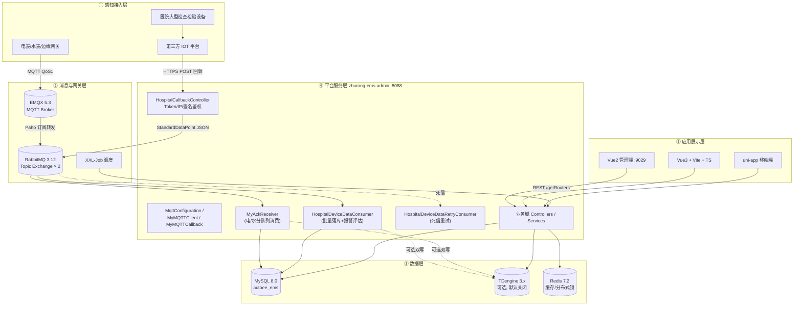
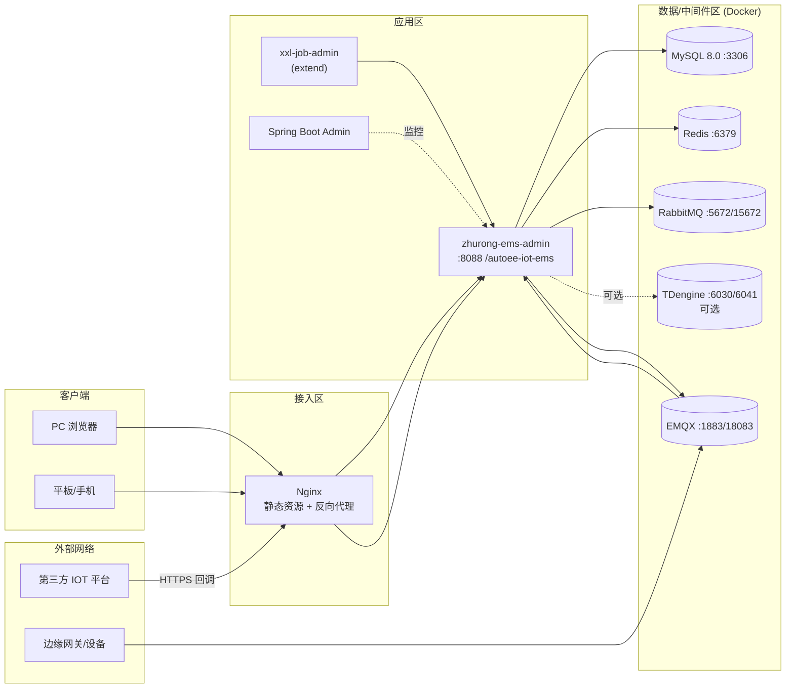
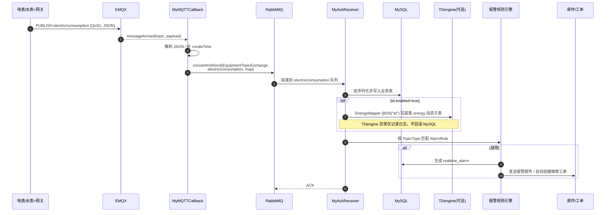

# 智慧能源管理平台 概要设计说明书

| 项目 | 内容 |
| --- | --- |
| 产品名称 | 智慧能源管理平台（zhurong-ems） |
| 系统版本 | V4.6.0 |
| 文档版本 | V1.0 |
| 文档类型 | 概要设计说明书（02-01） |
| 编制日期 | 2026-09-14 |
| 密级 | 内部 |
| 适用读者 | 架构师、后端/前端研发、测试、实施运维、项目管理人员 |

> 配套文档：[02-02 数据库设计说明书.md](./02-02%20数据库设计说明书.md)、[02-03 接口设计说明书.md](./02-03%20接口设计说明书.md)。
> 延伸阅读：[系统 MQTT使用与架构分析报告](../架构设计/Deep-EMS%20系统%20MQTT使用与架构分析报告.md)、[TDengine 在本项目中的角色分析](../架构设计/TDengine%20在本项目中的角色分析.md)、[MQTT → RabbitMQ → 存储 全链路闭环bug分析](../架构设计/MQTT%20%E2%86%92%20RabbitMQ%20%E2%86%92%20存储%20全链路闭环bug分析.md)、[docker-compose 部署配置总览](../部署指南/docker-compose%20部署配置总览.md)。

---

## 目录

1. 引言
2. 设计目标与设计原则
3. 总体架构设计
4. 技术架构与选型
5. Maven 多模块架构
6. 运行与部署架构
7. 数据采集链路详细设计
8. 业务子系统划分
9. 安全架构设计
10. 缓存与分布式协同设计
11. 定时任务设计
12. 多数据源与存储策略
13. 多端接入与国际化设计
14. 关键非功能性设计
15. 命名与分层约定
16. 附录

---

## 1. 引言

### 1.1 编写目的

本文档从系统总体视角描述 V4.6.0 的总体架构、技术选型、模块划分、部署形态、核心数据链路、安全与非功能设计，作为详细设计、数据库设计（见 [02-02](./02-02%20数据库设计说明书.md)）、接口设计（见 [02-03](./02-03%20接口设计说明书.md)）、开发实现与验收测试的共同依据。

### 1.2 系统定位

是面向建筑、园区、医院等场景的智慧能源管理平台，基于 **RuoYi 脚手架二次开发**（包名沿用 `com.ruoyi`，业务包扩展为 `com.cpems`），在通用能源监控能力之上，**加性叠加**了"医院智慧能源决策系统"。V4.6.0 的核心特征：

- **加性叠加、不破坏存量**：医院域（`hospital`）以独立包、独立数据表前缀（`hospital_`）、独立消息拓扑（`hospital.*`）方式叠加，既有 MQTT 直采链路保持不变。
- **双采集链路并存**：既有"MQTT 直采链路"（设备 → 网关 → EMQX → RabbitMQ → 存储/报警/工单）与医院新增"IOT HTTP 回调链路"（外部 IOT 平台 → 回调端点 → 鉴权 → MQ → 批量落库/报警）物理隔离、互不影响。
- **关系库 + 时序库双轨**：MySQL 承载业务与近期数据，TDengine 为可选时序存储（默认关闭 `td.enabled=false`），开启时高频数据双写，时序库故障不阻断主链路。
- **多端覆盖**：Vue2 管理端（主）、Vue3 新版前端、uni-app 移动端。

### 1.3 术语与缩略语

| 术语 | 说明 |
| --- | --- |
| EMS | Energy Management System，能源管理系统 |
| EMQX | 开源 MQTT 消息 broker |
| TDengine | 涛思时序数据库，本系统中数据源标识为 `td`，默认关闭 |
| 超表/子表 | TDengine 概念：STABLE 为超表模板，子表按标签（TAG）自动创建 |
| BO/VO/DTO | Business Object / View Object / Data Transfer Object |
| 院区数据隔离 | 医院场景下按院区（area/dept 维度）限制用户可见数据范围 |
| 加性叠加 | 新增能力以独立模块/表/消息拓扑追加，不修改既有契约 |
| ACK / NACK | RabbitMQ 消息确认 / 否认确认 |
| DLX | Dead Letter Exchange，死信交换机 |

---

## 2. 设计目标与设计原则

### 2.1 设计目标

| 维度 | 目标 |
| --- | --- |
| 业务目标 | 覆盖设备台账、能源监测、能效分析、报警运维、定额管理、充电桩运营、计量器具、新能源、调度预测、数字孪生、医院智慧能源决策等全域业务 |
| 接入目标 | 同时支持 MQTT 直采设备与第三方 IOT 平台 HTTP 回调两类数据源，新增数据源类型不改造既有链路 |
| 性能目标 | 单节点支撑千级设备点位秒级采集；回调接口毫秒级响应（鉴权 + 投递 MQ 后立即返回）；列表查询 P95 ≤ 1s |
| 可靠性目标 | 采集消息不丢（持久化 + 手动 ACK + 死信重试）；时序库故障不影响业务库；服务重启自动重连 MQTT/MQ |
| 安全目标 | 统一认证鉴权（Sa-Token + JWT）、三级权限（菜单/按钮/数据）、回调三重防护（Token/IP 白名单/签名）、防 XSS 与 SQL 注入 |
| 可维护目标 | 模块职责清晰、配置外化、脚本可重复初始化（`CREATE TABLE IF NOT EXISTS`）、全链路日志可追溯 |
| 国际化目标 | 支持 zh-CN / en / ru / id 四语言，菜单由后端动态下发 |

### 2.2 设计原则

1. **加性扩展原则（最高优先级）**：新业务优先以新包、新表、新交换机/队列方式叠加；严禁破坏既有 MQTT Topic、消息结构、表结构与 API 契约。
2. **异步削峰原则**：所有设备数据写入均经消息中间件异步落库，接入层不做重逻辑，避免突发流量击穿数据库。
3. **主链路优先原则**：MySQL 落库为主链路（Source of Truth）；TDengine、报警评估、邮件通知等旁路动作失败只记日志，不回滚主链路。
4. **失败可恢复原则**：MQ 消费采用手动 ACK，失败 `basicNack(requeue=false)` 进死信重试队列，超过最大次数转人工排查；MQTT 断线自动 5s 重连并重订阅。
5. **配置外化原则**：中间件地址、账号、回调 Token/白名单/签名开关、TDengine 开关均通过 `application-*.yml` 与 Docker 环境变量注入。
6. **标准化与兼容原则**：医院链路在进入 MQ 前将异构报文解析为平台统一的 `StandardDataPoint`，下游只依赖标准模型。
7. **JDK 1.8 强制原则**：全系统仅保证 JDK 1.8 兼容；高版本 JDK 启动必须追加 `--add-opens` 参数（见部署文档）。
8. **前后端契约稳定原则**：统一响应体 `Ajax/R`、统一分页体 `TableDataInfo`、动态路由由 `/getRouters` 下发，前端组件按 `@/views` 路径映射。

---

## 3. 总体架构设计

### 3.1 分层总体架构（ASCII）

系统在逻辑上划分为五层：**感知接入层 → 消息与网关层 → 数据层 → 平台服务层 → 应用展示层**，横切安全、运维监控与国际化体系。

```text
┌──────────────────────────────────────────────────────────────────────────────┐
│ ⑤ 应用展示层                                                                   │
│  Vue2 管理端(9029)   Vue3+Vite+TS 新版端   uni-app 移动端   Nginx 静态托管      │
│  ECharts 大屏/能耗分析   ElementUI 后台   动态路由(/getRouters)   i18n 4语言    │
└───────────────▲──────────────────────────────────▲───────────────────────────┘
                │ HTTP/REST (token: Bearer JWT)     │
┌───────────────┴──────────────────────────────────┴───────────────────────────┐
│ ④ 平台服务层 (Spring Boot 2.7.9 / Undertow, :8088, context /autoee-iot-ems)    │
│ ┌──────────┬──────────┬──────────┬──────────┬──────────┬──────────┬──────────┐ │
│ │设备/网关 │能源/质量 │报警/运维 │定额/计量 │充电桩运营│新能源/调度│数字孪生  │ │
│ ├──────────┼──────────┼──────────┼──────────┼──────────┼──────────┼──────────┤ │
│ │医院智慧能源决策域(10个Controller, com.cpems.web.controller.hospital)         │ │
│ ├──────────────────────────────────────────────────────────────────────────┤ │
│ │系统管理(用户/角色/菜单/部门/字典/参数/OSS/接口配置/同步引擎) 监控 报表 通用   │ │
│ └──────────────────────────────────────────────────────────────────────────┘ │
│  横切：Sa-Token 鉴权 · 全局异常 · XSS 过滤 · p6spy SQL · OpenAPI · Admin 监控  │
└───────▲───────────────────────────────▲──────────────────────▲───────────────┘
        │ 写/读                          │                    │
┌───────┴───────────────┐   ┌───────────┴──────────┐  ┌──────┴────────────────┐
│ ③ 数据层               │   │ Redis 7.2 缓存/锁     │  │ 外部服务               │
│ MySQL 8.0(autoee_ems) │   │ Redisson · Lock4j    │  │ 阿里云OSS · 短信        │
│ TDengine 3.x(可选,td) │   │ Token/字典/会话/限流  │  │ 邮件 · 视频平台 · IOT平台│
└───────▲───────────────┘   └──────────────────────┘  └───────────────────────┘
        │ 消费/写入
┌───────┴──────────────────────────────────────────────────────────────────────┐
│ ② 消息与网关层                                                                 │
│  RabbitMQ 3.12 (EquipmentTopicExchange / hospital.topic.exchange)             │
│  EMQX 5.3 (MQTT 1883/8883, 管理台 18083, WS 8083)   XXL-Job 2.3 调度中心       │
└───────▲──────────────────────────────────────────▲───────────────────────────┘
        │ MQTT(QoS1)                               │ HTTPS 回调(X-IOT-*)
┌───────┴───────────────────────┐        ┌─────────┴──────────────────────────┐
│ ① 感知接入层  链路① MQTT 直采   │        │ ① 感知接入层  链路② IOT HTTP 回调   │
│ 电表/水表 → 边缘网关 → EMQX    │        │ 医院 CT/MRI/DR/US/LAB/DSA 等设备    │
│ electric/* · water/* 主题      │        │ → 第三方 IOT 平台 → /hospital/      │
│                                │        │   callback/data                    │
└────────────────────────────────┘        └────────────────────────────────────┘
```

### 3.2 总体架构（Mermaid）



### 3.3 架构关键决策说明

| 决策点 | 选择 | 理由 |
| --- | --- | --- |
| 基础脚手架 | RuoYi（Spring Boot 版）二开 | 复用成熟的 RBAC、代码生成、字典、参数、日志体系，降低交付成本 |
| 接入协议 | MQTT + HTTP 回调双链路 | 直连设备走 MQTT；医院设备数据由第三方 IOT 平台汇聚，只能回调推送 |
| 消息中间件 | EMQX（南向）+ RabbitMQ（平台内） | EMQX 扛设备连接，RabbitMQ 做应用内削峰、路由与可靠投递，职责分离 |
| 时序存储 | TDengine 可开关、双写、旁路降级 | 高频数据查询性能好；但部分客户现场无 TDengine，故默认关闭且不阻断主链路 |
| 认证 | Sa-Token 1.34 + sa-token-jwt | 无状态 JWT 适配前后端分离与多端，注解式权限校验简单直观 |
| Web 容器 | Undertow | 高并发 IO 性能优于 Tomcat，内存占用低 |
| 新旧医院域隔离 | 独立包 + 独立表前缀 + 独立 MQ 拓扑 | 满足加性叠加约束，故障域隔离、可独立回滚 |

---

## 4. 技术架构与选型

### 4.1 技术选型总表

| 分类 | 选型 | 版本 | 用途与约束 |
| --- | --- | --- | --- |
| JDK | Oracle/OpenJDK | **1.8（强制）** | JDK9+ 需 `--add-opens`，详见 [打包部署常见问题](../部署指南/打包部署常见问题.md) |
| 核心框架 | Spring Boot | 2.7.9 | 自动装配、Web、AOP、校验 |
| Web 容器 | Undertow | 随 Boot 版本 | 替代默认 Tomcat |
| 安全框架 | Sa-Token + sa-token-jwt | 1.34 | 登录认证、`@SaCheckPermission`、JWT 无状态会话 |
| ORM | MyBatis-Plus | 3.5.3.1 | `@TableName/@TableId/@TableLogic`、条件构造器、批量 |
| 多数据源 | dynamic-datasource | 3.5.2 | `master`=MySQL，`td`=TDengine（`@DS("td")`，可开关） |
| SQL 监控 | p6spy | 随 Boot | 开发期 SQL 日志 |
| 缓存 | Redis 客户端 + Redisson | Redis 7.2 / Redisson 3.20 | Token、字典缓存、分布式锁；Lock4j 注解式锁 |
| MQTT | Eclipse Paho | v3 客户端 | EMQX 连接、订阅、自动重连 |
| 消息队列 | RabbitMQ（amqp-client） | 3.12 服务端 | TopicExchange、手动 ACK、死信重试 |
| 任务调度 | XXL-Job | 2.3.1 | 可视化调度中心，admin 在 extend 模块 |
| 应用监控 | Spring Boot Admin | 2.7.10 | 应用健康、JVM、日志级别动态调整 |
| 工具库 | Hutool、FastJSON2、Lombok | — | 通用工具、JSON 序列化（医院链路用 FastJSON 跨 MQ 传 `StandardDataPoint`） |
| Excel | EasyExcel + POI | 3.2.1 | 导入导出、批量记录 |
| PDF | OpenPDF | — | 报表/单据导出 |
| 模板引擎 | Velocity | — | 代码生成器模板（generator 默认未启用） |
| API 文档 | springdoc-openapi | 1.6.15 | OpenAPI 3 在线文档 |
| 对象存储 | AWS S3 SDK | — | 兼容 S3 协议的私有云/公有云 OSS |
| 短信 | 阿里云 / 腾讯云 SMS SDK | — | 报警与通知短信 |
| 前端（主） | Vue 2.6 + Element UI + Vuex + Vue Router + Axios + ECharts + vue-i18n | — | 管理后台，dev 端口 **9029** |
| 前端（新） | Vue3 + Vite + TypeScript（zhurong-admin-ui-v3） | — | 新版前端，并行演进 |
| 移动端 | uni-app（zhurong-uniapp） | — | 巡检、工单、告警移动处置 |
| 数据库 | MySQL | 8.0.35 | 库名 `autoee_ems`，utf8mb4 |
| 时序库 | TDengine | 3.x | 超表 `energy`、`hospital_device_data`，默认 `enabled=false` |

### 4.2 技术栈分层关系

```text
浏览器/移动端 ── HTTPS ──▶ Nginx ──▶ Undertow(Spring MVC)
                                        │
                    ┌───────────────────┼────────────────────┐
                    ▼                   ▼                    ▼
             Sa-Token 拦截器      Controller 参数校验     全局异常处理
                    │                   │
                    ▼                   ▼
              Service（事务/锁 Lock4j） ── Redisson ── Redis
                    │
        ┌───────────┼──────────────┐
        ▼           ▼              ▼
 MyBatis-Plus   RabbitMQ       AWS S3 / SMS / 邮件 / 视频平台
   @DS master   生产/消费
        │
        ▼
   MySQL 8.0；@DS("td") → TDengine 3.x（可选）
```

---

## 5. Maven 多模块架构

### 5.1 模块清单与职责

| 模块 | 角色 | 关键内容 |
| --- | --- | --- |
| `zhurong-ems-admin` | 启动与接入层 | `main` 启动类、全部 Controller（根包 `com.cpems.web.controller`）、`application*.yml`；打可执行 jar |
| `zhurong-ems-framework` | 框架基础设施 | Sa-Token 安全配置、拦截器、全局异常、XSS 过滤、数据源/Redis/MQ 配置类、AOP |
| `zhurong-ems-system` | 业务核心 | domain / bo / vo / dto / mapper / service；含医院子包 `com.ruoyi.system.hospital`（domain/bo/vo/dto/mapper/service/service.impl/mq/config/constant/energy/enums） |
| `zhurong-ems-job` | 定时任务 | XXL-Job 业务执行器任务 |
| `zhurong-ems-common` | 公共模块 | `Ajax/R`、`TableDataInfo`、`BaseEntity`、`PageQuery`、注解（`@Log/@DataScope/@RepeatSubmit`）、枚举、异常、工具 |
| `zhurong-ems-extend` | 扩展模块 | 内嵌 `xxl-job-admin` 调度控制台 |
| `zhurong-ems-oss` | 对象存储 | S3 兼容 OSS 封装 |
| `zhurong-ems-sms` | 短信 | 阿里/腾讯 SMS 适配 |
| `ruoyi-generator` / `ruoyi-demo` | 工具/示例 | 代码生成器与示例，**默认未启用** |

### 5.2 模块依赖关系

```text
                    ┌──────────────────────┐
                    │  zhurong-ems-admin   │  启动模块（Controller / 配置 / yml）
                    └───────────▲──────────┘
                                │ depends on
        ┌───────────┬───────────┼────────────┬─────────────┐
        │           │           │            │             │
┌───────┴──────┐ ┌──┴────────┐ ┌┴──────────┐ ┌┴───────────┐ ┌┴────────────┐
│ ems-frame-  │ │ ems-job   │ │ ems-oss   │ │ ems-sms     │ │ ems-extend  │
│ work(安全/  │ │ (定时任务) │ │ (S3 OSS)  │ │ (短信通道)  │ │ (xxl-admin) │
│ 拦截/异常)  │ └─────▲──────┘ └─────▲─────┘ └──────▲──────┘ └─────────────┘
└───────▲──────┘       │            │               │
        │              └────────────┴───────────────┘
        │                             │
┌───────┴─────────────────────────────┴──┐
│            zhurong-ems-system           │  domain/mapper/service（含 hospital 子域）
└───────────────────▲─────────────────────┘
                    │
┌───────────────────┴─────────────────────┐
│            zhurong-ems-common            │  R / Ajax / TableDataInfo / BaseEntity / 工具
└──────────────────────────────────────────┘
```

依赖方向铁律：**common 不依赖任何业务模块；system 只依赖 common；framework 依赖 system/common；admin 聚合一切**。医院子域位于 system 模块内部，不新增 Maven 模块，以包级隔离实现加性叠加。

### 5.3 医院子域包结构

```text
com.ruoyi.system.hospital
 ├── domain            实体：HospitalDevice / HospitalDeviceData / StandardDataPoint
 │                     HospitalArea / HospitalMetricDef / HospitalAlarmRule
 │                     HospitalAlarmRecord / HospitalCallbackLog / HospitalDeviceWorkload
 │    └── enums        HospitalDeviceType / HospitalMetricDataType
 ├── bo                入参对象（查询/新增/修改）
 ├── vo                出参对象（列表/详情/实时监控）
 ├── dto               IotCallbackRequest（外部回调报文）
 ├── mapper            MySQL Mapper + HospitalTdMapper(@DS("td"))
 ├── service / impl    业务服务、IotCallbackAuthService、IotDataParser、HospitalDataIngestService
 ├── mq                HospitalDeviceDataConsumer / HospitalDeviceDataRetryConsumer
 ├── config            HospitalRabbitConfig / HospitalIotProperties
 ├── constant          HospitalConstants
 └── energy            能耗分析 VO（总览/趋势/分类/效率/排名/建议）
```

---

## 6. 运行与部署架构

### 6.1 中间件清单（Docker Compose）

| 容器 | 版本 | 端口 | 账号/密码 | 说明 |
| --- | --- | --- | --- | --- |
| shared-mysql | MySQL 8.0.35 | 3306 | root / 123456 | 库 `autoee_ems` |
| shared-redis | Redis 7.2.3 | 6379 | 密码 `difyai123456` | 必须以 `--requirepass difyai123456` 启动 |
| shared-rabbitmq | 3.12-management | 5672 / 15672 | 本地 `rabbitmq/rabbitmqpassword`，vhost=`admin_vhost`；示例 compose 为 `guest/guest` | 管理台 15672 |
| shared-emqx | EMQX 5.3.2 | 1883 / 8883 / 18083 / 8081 / 8083 | admin / public（控制台） | MQTT/TCP、MQTT/TLS、Dashboard、WS/WSS |
| shared-tdengine | TDengine 3.x | 6030 / 6041 | root / difyai123456 | 默认可不启动；`td.enabled=false` |

一键启动：

```bash
docker compose up -d
```

详见 [docker-compose 部署配置总览](../部署指南/docker-compose%20部署配置总览.md) 与 [系统中间件清单](../部署指南/Deep-EMS%20系统中间件清单.md)。

### 6.2 后端运行

- 制品：`zhurong-ems-admin/target/zhurong-ems-admin.jar`
- 端口 / 上下文：`8088` / `/autoee-iot-ems`
- Profile：`local` / `dev` / `prod`
- 本地关闭 TDengine：`--spring.datasource.dynamic.datasource.td.enabled=false`

高版本 JDK（仅排障用，标准仍是 JDK1.8）需追加 `--add-opens java.base/java.lang=ALL-UNNAMED` 等参数，完整清单见项目根 [AGENTS.md](../../AGENTS.md) 与 [打包部署常见问题](../部署指南/打包部署常见问题.md)。

### 6.3 前端运行与部署

- 主前端目录 `zhurong-admin-ui`：`npm install && npm run dev`，本地访问 `http://localhost:9029`。
- 生产构建为静态资源，由 **Nginx** 托管，并反向代理 `/autoee-iot-ems` 到后端 8088。
- 生产环境编排文件 `docker-compose-54.yml` **已锁定不可改动**。

### 6.4 部署拓扑（Mermaid）



---

## 7. 数据采集链路详细设计

系统存在 **两条并存、相互隔离** 的采集链路。二者仅在"写入 MySQL / 可选 TDengine / 触发报警"这一目标上相似，Topic、交换机、队列、报文模型、鉴权方式完全独立。

### 7.1 链路①：MQTT 直采链路（既有）

#### 7.1.1 链路组件

| 组件 | 位置 | 职责 |
| --- | --- | --- |
| 设备/网关 | 现场 | 电表、水表经边缘网关按约定 Topic 上报 JSON |
| EMQX | 中间件 | MQTT Broker，承担设备连接与 Topic 路由 |
| `MqttConfiguration` | system.config | 读取 `mqtt.*` 配置，创建 `MyMQTTClient` Bean，启动时最多重试 10 次连接 |
| `MyMQTTClient` | system.config | Paho 客户端封装：connect / subscribe(QoS=1) / publish |
| `MyMQTTCallback` | system.config | `MqttCallbackExtended`：连接完成自动订阅；消息到达后解析并转发 RabbitMQ；断线 5s 重连 |
| `RabbitExChangeConfig` | system.config | 声明 `EquipmentTopicExchange` 与 U/I/P/W/水 5 个队列及绑定 |
| `MyAckReceiver` | system.config | 各队列消费者：反序列化 → 写 MySQL →（可选）写 TDengine → 匹配报警规则 → 邮件/工单 |
| `EnergyMapper` | system.mapper | `@DS("td")`，实体 `Energy`（`@TableName("energy")`，字段 `ts/client_id/val/type`），动态子表写入 |
| `AlarmRule` 匹配 | service | 按 `TopicType`（ELECTRIC_U/I/P/W）取规则，阈值比较触发 `RealtimeAlarm`、邮件通知、自动生成维修工单 |

#### 7.1.2 MQTT 订阅主题（TopicType 枚举）

| 枚举 | Topic（QoS=1） | 含义 | 转发路由键 |
| --- | --- | --- | --- |
| ELECTRIC_emsCarson | `electric/emsCarson` | 电表数据打包上传（厂商 Carson 格式） | `electric/emsCarson` |
| ELECTRIC_S | `electric/all/+` | 电表批量数组上报，按报文中 `deviceType` 拆分 | 拆分后转 U/I/P/W |
| ELECTRIC_U | `electric/voltage` | 电压 | `electric/voltage` |
| ELECTRIC_I | `electric/current` | 电流 | `electric/current` |
| ELECTRIC_P | `electric/power` | 功率 | `electric/power` |
| ELECTRIC_W | `electric/consumption` | 用电量 | `electric/consumption` |
| WATER_CONSUMPTION | `water/consumption/+` | 用水量（通配子主题，载荷为 JSON 数组，逐条转发） | `water/consumption/+` |

> 说明：`electric/all/+` 与 `water/consumption/+` 的载荷为 JSON 数组，回调内逐条解析；每条消息缺失 `createTime` 时自动补当前时间（`yyyy-MM-dd HH:mm:ss`）。

#### 7.1.3 RabbitMQ 拓扑（既有链路）

- 交换机：`EquipmentTopicExchange`，类型 **topic**，durable=true。
- 队列（队列名 = 路由键，均持久化）：

| 队列 | 路由键 | 数据 |
| --- | --- | --- |
| `electric/voltage` | `electric/voltage` | 电压 |
| `electric/current` | `electric/current` | 电流 |
| `electric/power` | `electric/power` | 功率 |
| `electric/consumption` | `electric/consumption` | 用电量 |
| `water/consumption/+` | `water/consumption/+` | 用水量 |

> 既有绑定代码中 P/W 两个 `@Bean` 方法名存在互换（`PExchangeMessage` 绑定 W 队列、`WExchangeMessage` 绑定 P 队列），但最终绑定关系仍一一对应，属于可读性缺陷而非功能缺陷，详见 [全链路闭环bug分析](../架构设计/MQTT%20%E2%86%92%20RabbitMQ%20%E2%86%92%20存储%20全链路闭环bug分析.md)。

#### 7.1.4 时序图（Mermaid）



#### 7.1.5 可靠性要点

- MQTT 侧：QoS=1 至少一次投递；`connectComplete` 中（重新）订阅，断线 5s 轮询重连，保证重连后自动恢复订阅。
- RabbitMQ 侧：交换机/队列持久化；消费者手动 ACK，处理失败的消息进入异常处理流程，避免毒消息无限 requeue。
- 启动时序：MqttConfiguration 最多重试 10 次（每次间隔 2s），避免 EMQX 未就绪导致应用启动失败。

### 7.2 链路②：IOT HTTP 回调链路（医院新增）

#### 7.2.1 设计约束

- 外部 IOT 平台只能以 **HTTPS POST + JSON** 主动推送，平台不主动拉取。
- 接入端点 **免登录**（无 Sa-Token 会话），安全由 `IotCallbackAuthService` 的三重机制保障。
- 端点只做"鉴权 → 标准化 → 投递 MQ → 写回调日志"，**同步链路不碰业务库数据表**，保证毫秒级响应与高并发承接。

#### 7.2.2 链路组件

| 组件 | 职责 |
| --- | --- |
| `HospitalCallbackController`（`POST /hospital/callback/data`） | 接收报文，读取 `X-IOT-Token/X-IOT-Sign` 头与客户端 IP，调用接入服务；成功返回 `R.ok("OK")`，失败返回 `R.fail(reason)` |
| `IotCallbackAuthService` | ① Token 比对；② IP 白名单（逗号/分号分隔，空=不限制）；③ 可选 HMAC-SHA256 签名（`hospital.iot.sign-enabled/sign-secret`） |
| `IotDataParser` | 将 `IotCallbackRequest` 解析为 `List<StandardDataPoint>`：按 `iot_device_id` 绑定 `hospital_device`，按 `metric` 绑定 `hospital_metric_def`，数值/状态分流到 `value/strValue` |
| `HospitalDataIngestService` | 编排：先落 `hospital_callback_log`（接收中状态）→ 鉴权 → 解析 → `convertAndSend(hospital.topic.exchange, hospital.device.data, JSON)` → 回写日志状态/点数/耗时 |
| `HospitalRabbitConfig` | 声明 topic 交换机、主队列（带 DLX 参数）、重试队列及绑定 |
| `HospitalDeviceDataConsumer` | 手动 ACK 消费：`insertBatch` 批量写 MySQL → 可选双写 TDengine → `HospitalAlarmEvalService` 报警评估；失败 `basicNack(requeue=false)` |
| `HospitalDeviceDataRetryConsumer` | 消费死信重试队列，按 `MAX_RETRY_TIMES=3` 重新投递主队列，超限留痕转人工 |
| `HospitalTdMapper` | `@DS("td")`，`insert into ${子表} using hospital_device_data tags(...) ...`，子表名 `deviceCode_metricCode`（非合法字符清洗为 `_`） |
| `HospitalAlarmEvalService` | 阈值（THRESHOLD）/离线（OFFLINE）规则评估，生成 `hospital_alarm_record`，支持级别升级与邮件通知 |

#### 7.2.3 RabbitMQ 拓扑（医院链路，与既有链路隔离）

| 类型 | 名称 | 说明 |
| --- | --- | --- |
| TopicExchange | `hospital.topic.exchange` | durable=true，配置键 `hospital.iot.exchange` |
| 主队列 | `hospital.device.data.queue` | durable=true；参数 `x-dead-letter-exchange=hospital.topic.exchange`、`x-dead-letter-routing-key=hospital.device.data.retry` |
| 主绑定 | routingKey `hospital.device.data` | 配置键 `hospital.iot.routing-key` |
| 重试（死信）队列 | `hospital.device.data.retry.queue` | durable=true |
| 重试绑定 | routingKey `hospital.device.data.retry` | 死信回流通道 |
| 最大重试 | `MAX_RETRY_TIMES = 3` | 超过后人工排查，保证消息不丢失 |

报文（跨 MQ 载体）：`List<StandardDataPoint>` 的 FastJSON 字符串。

`StandardDataPoint` 字段：`deviceId / deviceCode / metricCode / value(BigDecimal) / strValue(String) / ts(Date) / quality(0正常 1异常)`。

#### 7.2.4 时序图（Mermaid）

```mermaid
sequenceDiagram
    autonumber
    participant IOT as 外部 IOT 平台
    participant API as HospitalCallbackController
    participant LOG as HospitalCallbackLog
    participant AUTH as IotCallbackAuthService
    participant PAR as IotDataParser
    participant MQ as hospital.topic.exchange
    participant C as HospitalDeviceDataConsumer
    participant R as RetryConsumer
    participant DB as MySQL
    participant TD as TDengine(可选)
    participant EVAL as HospitalAlarmEvalService

    IOT->>API: POST /hospital/callback/data<br/>X-IOT-Token / X-IOT-Sign + JSON(msgId,timestamp,devices[])
    API->>LOG: insertLog(receive_time, source_ip, request_id)
    API->>AUTH: checkFailReason(token, ip, timestamp, msgId, sign)
    alt 鉴权失败
        AUTH-->>API: failReason
        API->>LOG: 更新 status=auth_fail
        API-->>IOT: R.fail("鉴权失败")
    else 通过
        API->>PAR: parse(request)
        PAR-->>API: List<StandardDataPoint>
        API->>MQ: convertAndSend(exchange, hospital.device.data, JSON)
        API->>LOG: 更新 status=success, device/point 数量, cost_time
        API-->>IOT: R.ok("OK")
        MQ->>C: 投递主队列
        C->>DB: insertBatch(hospital_device_data)
        opt td.enabled=true
            C->>TD: 写超表 hospital_device_data 子表(失败仅日志)
        end
        C->>EVAL: evalPoints(points)（异常仅日志）
        C-->>MQ: basicAck
    end
    Note over C,MQ: 任意异常 → basicNack(requeue=false) → DLX
    MQ->>R: 死信进入 hospital.device.data.retry.queue
    alt 重试 ≤ 3 次
        R->>MQ: 重新投递主队列
    else 超过 3 次
        R->>LOG: 留痕，告警人工排查（消息不再重投）
    end
```

#### 7.2.5 ACK、重试与最终一致性

1. **接入快速确认**：回调成功仅意味着"已鉴权并已投递 MQ"，平台随后异步返回 200，避免 IOT 平台因等待超时重推。
2. **至少一次 + 幂等容忍**：MQ 手动 ACK，宕机/重启后未 ACK 的消息会重新投递；数据点表采用追加写入，重复消息的影响通过下游按 `(device_id, metric_code, ts)` 查询去重/统计窗口消化（设计上容忍重复，不做同步唯一约束以保吞吐）。
3. **死信重试**：消费异常（如 MySQL 瞬断）`basicNack(deliveryTag, false, false)`，经 DLX 进入重试队列；重试消费者最多重新投递 3 次。
4. **旁路降级**：TDengine 写入、报警评估均 try-catch 隔离，**绝不影响 MySQL 主链路写入与 ACK**。
5. **全程留痕**：每次回调在 `hospital_callback_log` 记录 request_id（IOT msgId）、来源 IP、设备数、点数、状态（success/auth_fail/parse_fail/fail）、错误信息与耗时，支持对账与补偿。

### 7.3 两条链路对比

| 对比项 | 链路① MQTT 直采 | 链路② IOT HTTP 回调 |
| --- | --- | --- |
| 触发方 | 设备/网关主动 PUBLISH | 第三方 IOT 平台 POST 推送 |
| 入口 | EMQX + Paho 订阅 | `POST /hospital/callback/data`（免登录） |
| 鉴权 | EMQX 连接账号 | Token + IP 白名单 + 可选 HMAC 签名 |
| 标准模型 | Map（clientId/value/createTime） | `StandardDataPoint`（强类型） |
| 交换机 | EquipmentTopicExchange | hospital.topic.exchange |
| 队列 | U/I/P/W/水 5 队列 | 主队列 + 死信重试队列 |
| MySQL 表 | 能源/设备相关表 + `realtime_alarm` | `hospital_device_data`、`hospital_callback_log`、`hospital_alarm_record` |
| TDengine 超表 | `energy`（动态子表） | `hospital_device_data`（子表 `deviceCode_metricCode`） |
| 报警 | AlarmRule → 邮件 + 维修工单 | HospitalAlarmRule → HospitalAlarmRecord（阈值/离线/升级） |
| 失败策略 | 手动 ACK + 异常处理 | 手动 ACK + DLX 重试 3 次 + 人工兜底 |

---

## 8. 业务子系统划分

Controller 统一位于 `zhurong-ems-admin` 的 `com.cpems.web.controller` 包，按业务域分包：

| 子系统 | Controller（代表） | 核心职责 |
| --- | --- | --- |
| 设备管理 equipment | EquipmentInfo、Gateway | 设备/网关台账、SN、二维码、状态 |
| 能源管理 energy | Energy、EnergyQuality、EnergyBalance、BenchmarkStandard、BatchRecord | 能耗数据、电能质量、能流平衡、对标基准、批量导入 |
| 分项分析 itemizeanalysis | ItemizeAnalysis | 照明/空调/动力/特殊等分项能耗分析 |
| 报警中心 alarm | RealtimeAlarm（`/alarm`）、AlarmHistory、AlarmRule（`/system/alarmRule`） | 实时报警、历史报警、规则配置 |
| 运维巡检 inspection | InspectionPlan、InspectionRecord、RepairOrder、Duty、Schedule、ExampleReport | 巡检计划/记录、维修工单、值班、排班、报告样板 |
| 库存供应商 inventory | PurveyorInfo、AttachmentInfo | 供应商、备件附件 |
| 危化品/安保 autoee | GoodsInfo、GoodsInventory、GoodsStockIn/Out、DangerGoods*、ContractInfo、PatrolPoint/Path/Plan/Task/Record/Alarm、MaintainOrder | 物资库存、危化品、合同、巡更点/路线/计划/任务/记录/报警、保养单 |
| 定额管理 quota | QuotaConfig | 能耗定额配置与考核 |
| 充电桩 chargingStation | ChargingStation、ChargingPile、Merchant、Brand、ChargingBrand、Model、OrderInfo、OccupancyOrder、ChargingPriceStrategy、ChargingPriceParam | 站/桩/商户/品牌型号、充电与占用订单、计价策略与参数 |
| 碳排放 carbon | Carbon | 碳排放核算与分析 |
| 视频监控 camera | CameraConfig | 摄像头/视频平台配置 |
| 数据查询 dataQuery | DataQuery | 统一数据查询入口 |
| 计量管理 metering | MeterInfo、CalibrationPlan、CalibrationRecord | 计量器具台账、校准计划/记录 |
| 制度管理 management | StandardInfo、RegulationInfo、PrePlan、ProcessInfo | 标准、法规、预案、流程 |
| 新能源 newenergy | PvStation、VirtualPowerPlant、StorageSystem、StorageBattery、EnergyStorage、MicroGrid、NewEnergyStatistics | 光伏、虚拟电厂、储能、微电网、新能源统计 |
| 用水管理 water | Water | 水平衡与用水分析 |
| 调度决策 dispatch | LoadForecast、EnergyDemandForecast、EnergyPriceForecast、WeatherForecast、ProductionEnergyCollaboration、OptimizationScheme、OptimizationAlgorithm、NetworkNode、DistributionNetwork、DispatchCommand、Evaluation、EvaluationReport、EnergyPlan、ForecastModelConfig | 负荷/需求/电价/天气预测、源网荷储协同、优化方案与算法、配网节点、调度指令、评估报告、能源计划、预测模型配置 |
| 数字孪生 digitaltwin | TwinDevice、ThreeDModel、EnergyFlow | 孪生设备、3D 模型、能流动画 |
| 设备控制 control | ControlDevice | 受控设备下行控制 |
| 报表中心 report | ReportEngine、ReportTemplate | 报表引擎与模板 |
| **医院智慧能源 hospital** | HospitalCallback、HospitalCallbackLog、HospitalDevice、HospitalMetricDef、HospitalArea、HospitalMonitor、HospitalEnergy、HospitalDeviceWorkload、HospitalAlarmRule、HospitalAlarmRecord | IOT 回调接入、回调日志、设备台账、指标定义、院区、实时监测、能耗分析、设备负荷、报警规则/记录 |
| 系统管理 system | SysUser/Role/Menu/Dept/Post/DictType/DictData/Config/Notice/Profile/Login/Register、Oss/OssConfig、LogoInfo、ItemTopology、Charging/ChargingStep、Mqtt/Rabbitmq、SysInterfaceConfig、SysIntegrationConfig、SysApiInterface、SysSyncTask、SysSyncExecution、SyncEngine | RBAC、字典参数、通知、OSS、Logo、拓扑、充电向导、MQ 配置、接口与集成配置、同步任务/执行/引擎 |
| 系统监控 monitor | SysUserOnline、SysOperlog、SysLogininfor、Cache | 在线用户、操作日志、登录日志、缓存监控 |
| 通用 common | Captcha | 验证码等公共能力 |

---

## 9. 安全架构设计

### 9.1 认证与授权

- **认证**：Sa-Token 1.34 + `sa-token-jwt`，登录成功签发 JWT，前端后续请求在 `Authorization`（或约定 token 头）携带；多端共用同一套无状态令牌。
- **授权三级模型**：
  1. **菜单权限**：`sys_menu` 配置目录/菜单/按钮，登录后经 `/getRouters` 动态下发，前端 `store/modules/permission.js` 的 `GenerateRoutes` 将后端 `component` 字符串映射到 `@/views` 下的 Vue 组件。
  2. **按钮/接口权限**：权限标识串（如 `system:user:add`、`hospital:device:list`），后端 `@SaCheckPermission("xxx")` 校验，前端 `v-hasPermi` 控制按钮显隐。
  3. **数据权限**：RuoYi `@DataScope` 机制按部门/角色拼接 SQL 过滤；医院域 `HospitalDataScopeService` 在此基础上实现**院区数据隔离**，用户仅可见授权院区（area）/科室（dept）下的设备、数据点、报警与能耗。
- **登录配套**：验证码（Captcha）、登录日志 `sys_logininfor`、在线用户管理（可踢人下线）、密码加密存储。

### 9.2 医院 IOT 回调鉴权（免登录端点）

三重防护，任一步失败即拒绝并记录 `auth_fail`：

1. **Token**：请求头 `X-IOT-Token` 必须等于配置 `hospital.iot.auth-token`（默认值仅用于开发环境，生产必须覆盖）。
2. **IP 白名单**：`hospital.iot.ip-whitelist`（逗号/分号分隔，空=不限制）；IP 获取依次取 `X-Forwarded-For` 首个地址、`X-Real-IP`、`RemoteAddr`，适配 Nginx 反代。
3. **签名（可选）**：`hospital.iot.sign-enabled=true` 且配置 `sign-secret` 时启用；算法 `hex(HMAC_SHA256(secret, timestamp + "\n" + msgId))`，请求头 `X-IOT-Sign` 携带，大小写不敏感比较。

### 9.3 传输与应用安全

| 类别 | 措施 |
| --- | --- |
| 传输 | 生产全链路 HTTPS；MQTT 可走 8883(TLS)/8083(WSS)；RabbitMQ 使用独立 vhost 与专用账号 |
| XSS | 框架层 XSS 过滤器对入参做转义/清洗 |
| SQL 注入 | MyBatis 参数化绑定；`HospitalTdMapper` 中子表名经白名单字符清洗（`[^a-zA-Z0-9_]→_`），杜绝表名注入 |
| 越权 | 所有业务接口默认需要登录与权限标识；回调端点单独鉴权且不进入会话体系 |
| 幂等/重复提交 | 新增类接口使用 `@RepeatSubmit`；回调以 IOT `msgId` 作为 request_id 留痕，支持重复推送识别 |
| 操作审计 | `@Log` 注解记录操作日志 `sys_oper_log`；回调日志独立留存 |
| 密钥管理 | 中间件密码、JWT 密钥、OSS/SMS 凭证、回调 token/secret 经环境变量/配置中心注入，禁止硬编码入库 |
| 逻辑删除 | `del_flag`（0 存在 / 2 删除）配合 `@TableLogic`，避免误删导致的数据外泄与丢失 |

---

## 10. 缓存与分布式协同设计

### 10.1 Redis 使用规划

| 用途 | 说明 |
| --- | --- |
| 登录态/Token | Sa-Token 会话与 JWT 注销/续签辅助 |
| 字典缓存 | `sys_dict_data` 缓存，减少字典类高频查询 |
| 参数配置 | `sys_config` 参数缓存 |
| 验证码 | Captcha 验证码短 TTL 存储 |
| 在线用户 | 会话与踢人下线 |
| 业务热点 | 实时监测、菜单、拓扑等热点只读数据 |
| 限流 | 登录、回调等热点入口的计数限流 |

### 10.2 分布式锁

- **Redisson 3.20** 提供可靠锁实现（看门狗自动续期）。
- **Lock4j** 提供 `@Lock4j` 注解式锁，用于：同步任务并发抢占（`SysSyncTask`/`SyncEngine`）、报警去重、定时任务多实例防重、库存出入库、订单状态流转等。
- 锁粒度原则：**锁业务键不锁全表**（如 `lock:hospital:alarm:{deviceId}:{metricCode}`），执行体尽量短，杜绝锁内做远程调用。

---

## 11. 定时任务设计

- 调度中心：**XXL-Job 2.3.1**，调度控制台内嵌于 `zhurong-ems-extend`（xxl-job-admin），执行器任务位于 `zhurong-ems-job`。
- 典型任务：

| 任务 | 说明 |
| --- | --- |
| 报警超时升级 | 扫描未处置报警，按 `escalate_min` 升级 `alarm_level`（医院域） |
| 设备离线判定 | 超过 `hospital.iot.monitor-offline-minutes`（默认 30 分钟）无数据点置为离线，可触发 OFFLINE 规则 |
| 能耗统计汇总 | 日/月能耗聚合、分项/院区/科室汇总写入统计结果 |
| 计量校准提醒 | 按 `next_calibration_date` 与校准周期生成预警 |
| 报表生成 | 周期性报告/导出任务 |
| 数据同步 | `SysSyncTask` 定义、`SysSyncExecution` 记录执行历史，由 `SyncEngine` 调度外部接口同步 |

- 设计要点：任务幂等可重跑；分片执行支持横向扩容；调度中心与执行器分离，应用多实例部署时由调度中心保证单触发，配合 Lock4j 做业务层二次防重。

---

## 12. 多数据源与存储策略

### 12.1 dynamic-datasource 策略

| 数据源 | 标识 | 存储 | 默认 | 切换方式 |
| --- | --- | --- | --- | --- |
| 主库 | `master` | MySQL 8.0 `autoee_ems` | 启用 | 默认 |
| 时序库 | `td` | TDengine 3.x（库 `energy`） | **关闭**（`td.enabled=false`） | Mapper/方法级 `@DS("td")` |

- 切换粒度：类/方法级注解；跨源**不使用同一本地事务**，采用"主库事务 + 时序库旁路"的最终一致模型。
- 开关：`spring.datasource.dynamic.datasource.td.enabled`，关闭时启动不创建 TDengine 连接池，`@DS("td")` 调用路径不被触发。

### 12.2 读写与冷热策略

- **热数据**：近期明细（如最近 1~3 个月）保留 MySQL，支撑后台列表、详情与报表联表查询。
- **高频时序数据**：开启 TDengine 时，电压/电流/功率/高频指标双写时序超表，按时间与标签聚合查询。
- **冷数据**：按保留策略归档；TDengine 侧通过其原生保留周期（KEEP）自动过期。
- **日志类数据**：操作日志、登录日志、回调日志按时间分区/定期清理。

---

## 13. 多端接入与国际化设计

### 13.1 多端

| 端 | 工程 | 技术 | 说明 |
| --- | --- | --- | --- |
| 管理端（主） | zhurong-admin-ui | Vue2.6 + ElementUI + Vuex + VueRouter + Axios + ECharts + vue-i18n | dev 端口 9029 |
| 新版前端 | zhurong-admin-ui-v3 | Vue3 + Vite + TS | 并行演进 |
| 移动端 | zhurong-uniapp | uni-app | 告警处置、巡检、工单 |

动态路由机制：登录后请求 `/getRouters` 获取菜单树 → `store/modules/permission.js` 的 `GenerateRoutes` 把后端返回的 `component` 路径映射为 `@/views/**/*.vue` 组件 → 注入 VueRouter。**后端菜单即前端路由**，新增页面须同步配置菜单与组件路径。

### 13.2 国际化

- 语种：zh-CN（默认）、en（英语）、ru（俄语）、id（印尼语）。
- 方案：vue-i18n 资源包 + ElementUI 语言包；菜单名称支持国际化键，方案见 [后台菜单国际化详细处理方案](../后台菜单国际化详细处理方案.md) 与 [国际化开发详细计划](../国际化开发详细计划.md)。
- 后端字典/枚举返回 code，展示文案由前端按语言解析；时间统一 `yyyy-MM-dd HH:mm:ss`。

---

## 14. 关键非功能性设计

### 14.1 性能

- 接入层无阻塞：回调只做鉴权与 MQ 投递；MQTT 转发仅做轻量解析。
- 消费侧批量写：医院数据点 `insertBatch` 批量入库，降低往返开销。
- 索引：高频查询列建组合索引（如 `idx_device_metric_ts(device_id, metric_code, ts)`），列表查询全部分页（`PageQuery` + `TableDataInfo`）。
- 缓存：字典、参数、热点监测数据走 Redis；ECharts 大屏走聚合接口。
- p6spy 仅在开发环境输出完整 SQL，生产关闭避免 IO 放大。

### 14.2 高可用

| 层 | 手段 |
| --- | --- |
| 接入 | MQTT 自动重连重订阅；RabbitMQ 持久化与手动 ACK；回调无状态可水平扩多实例 |
| 消息 | 交换机/队列/消息持久化；死信重试队列；消费幂等 |
| 应用 | 无状态 JWT + Redis 会话，支持多实例；Spring Boot Admin 健康监控 |
| 数据 | MySQL 定期备份；Redis 可重启重建缓存；TDengine 故障自动降级旁路 |
| 任务 | XXL-Job 调度中心故障不影响已调度执行器；任务幂等可补偿 |

### 14.3 可扩展

- 新增设备类型：扩展 `TopicType`/指标字典与解析映射，不改消费骨架。
- 新增第三方数据源：复用"鉴权 → 标准化 `StandardDataPoint` → hospital MQ → 消费"骨架，仅新增协议适配。
- 新增业务域：按 `controller(domain) + system(domain:domain/bo/vo/mapper/service)` 分层加包加表，菜单与权限增量初始化。
- 存储扩展：TDengine 超表按 TAG 自动建子表，无需预建。

### 14.4 可观测

- 日志：链路关键节点（接收、鉴权、转发、落库、报警、重试）均输出结构化日志，携带 requestId/deviceCode/metricCode。
- 监控：Spring Boot Admin 2.7.10 监控 JVM/线程/健康；RabbitMQ/EMQX/MySQL/Redis 各自管理台可观测。
- 审计：`sys_oper_log`、`sys_logininfor`、`hospital_callback_log` 三类日志分别覆盖人工操作、登录、机器回调。

---

## 15. 命名与分层约定

### 15.1 后端分层与命名

| 层 | 命名/位置 | 约定 |
| --- | --- | --- |
| Controller | `com.cpems.web.controller.<domain>` | `XxxController`；继承 `BaseController`；返回 `R<T>`/`Ajax` 或 `TableDataInfo<XxxVo>`；`@SaCheckPermission` 鉴权、`@Log` 审计、`@RepeatSubmit` 防重 |
| Service | `com.ruoyi.system.<domain>.service` | 接口 `IXxxService`，实现 `service.impl.XxxServiceImpl` |
| 入参 | `bo/XxxBo` | 查询/新增/编辑入参，分组校验 `AddGroup/EditGroup` |
| 出参 | `vo/XxxVo` | 列表/详情出参，隔离实体与敏感字段 |
| 实体 | `domain/Xxx` | `@TableName("snake_name")`，主键 `@TableId`（雪花 `ASSIGN_ID`），逻辑删除 `@TableLogic` |
| 数据载体 | `dto/`、`domain/StandardDataPoint` | 跨系统/跨 MQ 的序列化模型，`implements Serializable` |
| Mapper | `mapper/XxxMapper` | MySQL 默认数据源；时序用 `@DS("td")` 独立 Mapper |
| MQ | `config`（声明）+ `mq`（消费者） | 交换机/队列名常量统一定义 |

### 15.2 REST 与数据约定

- API 前缀：`/system/xxx`（系统管理类）；业务域按 `/<domain>/xxx`（如 `/hospital/device`）；统一 context-path `/autoee-iot-ems`。
- 标准动作：列表 `GET /list`、详情 `GET /{id}`（医院新域多为 `/info/{id}`）、新增 `POST`、修改 `PUT`、删除 `DELETE /{id}`。
- 主键：BIGINT 雪花 ID；时间字段：字符串 `yyyy-MM-dd HH:mm:ss`；金额/度量：`DECIMAL`/`BigDecimal`。
- 逻辑删除：`del_flag`：0 存在、2 删除（医院新表多数不做物理删除字段，采用状态停用；计量表历史上使用 0/1，以实际表注释为准）。
- 状态码：成功 `code=200`；失败返回错误码与消息（详见 [02-03 接口设计说明书](./02-03%20接口设计说明书.md)）。

### 15.3 数据库对象命名

- 表/字段：小写蛇形（snake_case）；业务表按域前缀分组：`sys_`（系统）、`equipment_/alarm_/quota_/charging_/meter_/hospital_` 等。
- 索引：主键 `PRIMARY`；唯一索引 `uk_<列>`；普通索引 `idx_<列>`；组合索引按等值→范围→时间排列。
- TDengine：超表用语义名单数（`energy`、`hospital_device_data`）；医院子表 `deviceCode_metricCode` 清洗非法字符。

---

## 16. 附录

### 16.1 关键配置键速查

| 配置键 | 默认/示例 | 说明 |
| --- | --- | --- |
| `server.port` / `server.servlet.context-path` | 8088 / `/autoee-iot-ems` | 后端监听 |
| `spring.profiles.active` | local/dev/prod | 环境 |
| `spring.datasource.dynamic.datasource.master.*` | localhost:3306 / autoee_ems / root / 123456 | MySQL |
| `spring.datasource.dynamic.datasource.td.enabled` | false | TDengine 开关 |
| `spring.redis.*` | localhost:6379，密码 `difyai123456` | Redis |
| `spring.rabbitmq.*` | 5672，本地 `rabbitmq/rabbitmqpassword`，vhost `admin_vhost` | RabbitMQ |
| `mqtt.host/username/password/clientId/timeout/keepalive` | EMQX 1883 | MQTT 连接 |
| `hospital.iot.auth-token` | `hospital-iot-2026`（**生产必改**） | 回调 Token |
| `hospital.iot.sign-enabled` / `sign-secret` | false / 空 | 回调签名开关与密钥 |
| `hospital.iot.ip-whitelist` | 空（不限制） | 回调 IP 白名单 |
| `hospital.iot.exchange/queue/routing-key` | `hospital.topic.exchange` / `hospital.device.data.queue` / `hospital.device.data` | 医院 MQ 拓扑 |
| `hospital.iot.monitor-offline-minutes` | 30 | 离线判定阈值 |

### 16.2 参考文档索引

- [02-02 数据库设计说明书](./02-02%20数据库设计说明书.md)
- [02-03 接口设计说明书](./02-03%20接口设计说明书.md)
- [系统 MQTT使用与架构分析报告](../架构设计/Deep-EMS%20系统%20MQTT使用与架构分析报告.md)
- [TDengine 在本项目中的角色分析](../架构设计/TDengine%20在本项目中的角色分析.md)
- [系统集成模块技术文档](../技术文档/系统集成模块技术文档.md)
- [docker-compose 部署配置总览](../部署指南/docker-compose%20部署配置总览.md)
- [打包部署常见问题](../部署指南/打包部署常见问题.md)
- [视频平台接入方案](../视频平台接入方案.md)

---

*— 本文档基于 V4.6.0 源码与部署事实编制，文档版本 V1.0，2026-09-14。*
