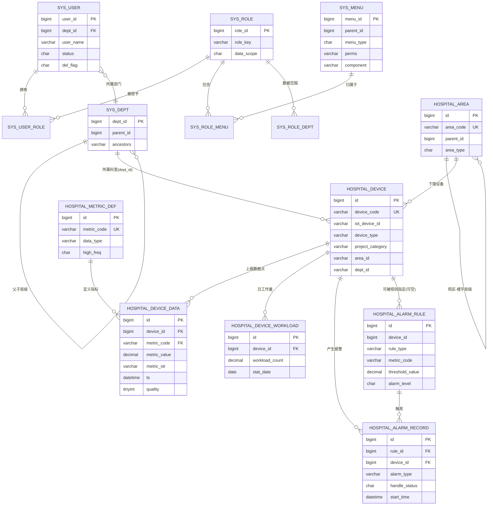
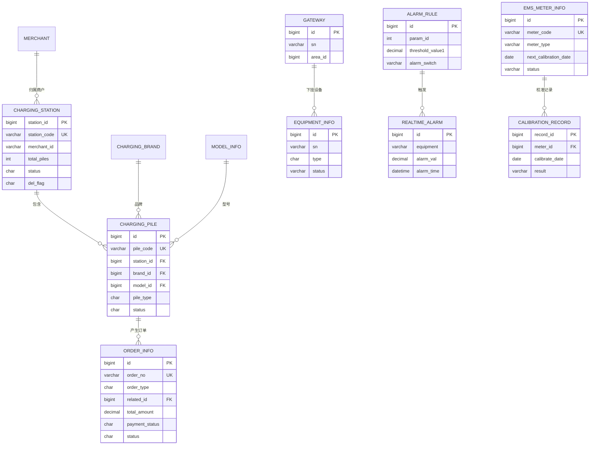

# 智慧能源管理平台 数据库设计说明书

| 项目 | 内容 |
| --- | --- |
| 产品名称 | 智慧能源管理平台（zhurong-ems） |
| 系统版本 | V4.6.0 |
| 文档版本 | V1.0 |
| 文档类型 | 数据库设计说明书（02-02） |
| 编制日期 | 2026-09-14 |
| 密级 | 内部 |
| 适用读者 | 架构师、后端研发、DBA、测试、实施运维 |

> 配套文档：[02-01 概要设计说明书.md](./02-01%20概要设计说明书.md)、[02-03 接口设计说明书.md](./02-03%20接口设计说明书.md)。
> 本文字段定义以源码实体（`com.ruoyi.system.**.domain`）与 `数据库脚本/`、`.dev/dumps/ems_full.sql` 中的实际 DDL 为准。

---

## 目录

1. 数据库环境与连接
2. 设计约定与规范
3. 表清单（按业务域分组）
4. 系统管理核心表结构
5. 设备与报警核心表结构
6. 充电桩与计量核心表结构
7. 医院智慧能源核心表结构
8. 实体关系图（ER 图）
9. 索引设计
10. TDengine 时序数据模型
11. 数据字典
12. 初始化与迁移脚本清单
13. 备份与恢复策略

---

## 1. 数据库环境与连接

### 1.1 环境信息

| 项 | MySQL（主库 master） | TDengine（时序库 td，可选） |
| --- | --- | --- |
| 版本 | 8.0.35 | 3.x |
| 库名 | `autoee_ems` | `energy` |
| 地址（本地） | localhost:3306 | localhost:6030 / REST 6041 |
| 地址（Docker） | shared-mysql:3306 | shared-tdengine:6030/6041 |
| 账号/密码 | root / 123456 | root / difyai123456 |
| 字符集/排序序 | `utf8mb4`（默认 `utf8mb4_general_ci`，新模块多为 `utf8mb4_0900_ai_ci`） | — |
| 引擎 | InnoDB（ROW_FORMAT=DYNAMIC） | 原生时序引擎 |
| 是否默认启用 | 是 | **否**（`spring.datasource.dynamic.datasource.td.enabled=false`） |
| 访问方式 | MyBatis-Plus，默认数据源 | `@DS("td")`，JDBC `jdbc:TAOS-RS://.../energy` |

### 1.2 连接配置要点

- 多数据源由 dynamic-datasource 3.5.2 管理：`master` 承载全部业务，`td` 通过 `@DS("td")` 在 Mapper/方法级切换。
- 关闭 TDengine（默认）时，应用启动不创建 td 连接池，时序写入分支不被触发，系统仅使用 MySQL。
- 开发环境 SQL 日志由 p6spy 输出；生产环境关闭。
- TDengine 手动建库建表步骤见 [TDengine 手动初始化操作手册](../部署指南/TDengine%20手动初始化操作手册.md)。

---

## 2. 设计约定与规范

### 2.1 通用约定

| 约定项 | 规则 |
| --- | --- |
| 主键 | BIGINT，雪花算法 `ASSIGN_ID`，实体 `@TableId(value="xxx_id"/"id")`；少量运营表（充电桩/订单/计量）使用自增 BIGINT |
| 逻辑删除 | `del_flag`：`0`=存在，`2`=删除，实体字段加 `@TableLogic`；计量表历史版本为 `0/1`，以表注释为准 |
| 审计字段 | 继承 `BaseEntity`：`create_by/create_time/update_by/update_time`，部分表含 `remark` |
| 时间类型 | DATETIME；接口与报文统一字符串 `yyyy-MM-dd HH:mm:ss` |
| 数值精度 | 金额/功率/阈值 `DECIMAL(p,s)`，Java 侧 `BigDecimal`；禁止用浮点存金额 |
| 布尔/状态 | CHAR(1) 或 VARCHAR 编码，含义写进 COMMENT，配套字典/枚举 |
| 字符集 | 建库建表统一 utf8mb4，支持 emoji 与多语言（zh-CN/en/ru/id） |
| 命名 | 表名、字段名小写蛇形（snake_case）；业务表带域前缀 |
| 外部关联 | IOT 平台设备 ID 用 `iot_device_id` 单独留存，不作为主键；跨库关联在应用层完成 |
| 加性叠加 | 医院表统一 `hospital_` 前缀，不修改既有表语义；新需求以 `IF NOT EXISTS` 建表、增量 `ALTER` 追加列 |

### 2.2 命名规范

| 对象 | 规范 | 示例 |
| --- | --- | --- |
| 表 | `域前缀_业务名`（单数） | `equipment_info`、`alarm_rule`、`hospital_device_data` |
| 主键 | `id` 或 `<表简写>_id` | `id`、`station_id`、`meter_code` |
| 外键列 | `<引用表>_id`（逻辑外键，不建物理 FK） | `device_id`、`station_id`、`rule_id` |
| 唯一索引 | `uk_<列名>` | `uk_device_code`、`uk_order_no` |
| 普通索引 | `idx_<列名>`，组合索引列序：等值→排序→范围/时间 | `idx_device_metric_ts` |
| 状态列 | `status`/`del_flag`/`alarm_level` 等 | CHAR(1) |
| TDengine 超表 | 业务语义单数 | `energy`、`hospital_device_data` |
| TDengine 子表 | `deviceCode_metricCode`（非法字符清洗为 `_`） | `iot_001_power` |

> 全库不使用数据库物理外键，关联完整性由应用层保证，便于分库分表与高频写入。

---

## 3. 表清单（按业务域分组）

下表列出主要业务域与代表表（全库表数量以 `.dev/dumps/ems_full.sql` 实际导出为准，共约百张量级）。

| 业务域 | 表前缀/代表表 | 数量级 | 说明 |
| --- | --- | --- | --- |
| 系统管理 | `sys_user`、`sys_role`、`sys_menu`、`sys_dept`、`sys_post`、`sys_dict_type`、`sys_dict_data`、`sys_config`、`sys_notice`、`sys_oper_log`、`sys_logininfor` | 10+ | RuoYi 基表，RBAC/字典/参数/日志 |
| 设备网关 | `equipment_info`、`gateway` 及设备数据相关表 | 数张 | 设备/网关台账与采集数据 |
| 能源管理 | 能源/质量/平衡/对标/批量记录相关表 | 十余张 | energy、energy_quality、energy_balance、benchmark_standard、batch_record 等 |
| 报警 | `alarm_rule`、`realtime_alarm`、`alarm_history` | 3+ | 规则、实时报警、历史报警 |
| 定额 | `quota_config` 等 | 少量 | 能耗定额 |
| 运维巡检 | inspection_*、repair_order、duty、schedule 等 | 十余张 | 计划/记录/工单/值班排班 |
| 库存/危化/巡更 | purveyor_info、attachment_info、goods_*、danger_goods_*、contract_info、patrol_*、maintain_order | 二十张左右 | 供应链与安保后勤 |
| 充电桩 | `charging_station`、`charging_pile`、`order_info`、occupancy_order、merchant、brand、charging_brand、model、charging_price_strategy/param | 十张左右 | 站/桩/商户/品牌型号/订单/计价 |
| 计量器具 | `ems_meter_info`、calibration_plan、calibration_record | 3+ | 器具台账与校准 |
| 碳排放/水电/新能源/调度/孪生/视频/报表 | carbon、water、pv_station、virtual_power_plant、storage_*、micro_grid、load_forecast 等 | 数十张 | 高级业务域 |
| 平台集成 | sys_interface_config、sys_integration_config、sys_api_interface、sys_sync_task、sys_sync_execution、oss_config、mqtt/rabbitmq 配置等 | 十张左右 | 外部系统对接与同步引擎 |
| **医院智慧能源** | `hospital_device`、`hospital_device_data`、`hospital_area`、`hospital_metric_def`、`hospital_alarm_rule`、`hospital_alarm_record`、`hospital_callback_log`、`hospital_device_workload` | 8 | 加性叠加，独立闭环（含 1 张 TDengine 超表同名） |

---

## 4. 系统管理核心表结构

> 以下为 RuoYi 标准基表的平台通用字段设计（随脚手架版本可能有少量列差异，以实际 `sys_*.sql`/导出为准）。

### 4.1 sys_user（用户表）

| 字段 | 类型 | 含义 | 约束 |
| --- | --- | --- | --- |
| user_id | BIGINT | 用户 ID | PK，雪花 |
| dept_id | BIGINT | 部门 ID | 逻辑关联 sys_dept.dept_id，索引 |
| user_name | VARCHAR(30) | 登录账号 | 非空，唯一 |
| nick_name | VARCHAR(30) | 用户昵称 | 非空 |
| user_type | VARCHAR(10) | 用户类型（00 系统用户） | 默认 00 |
| email | VARCHAR(50) | 邮箱 | — |
| phonenumber | VARCHAR(11) | 手机号 | — |
| sex | CHAR(1) | 性别（0男 1女 2未知） | 默认 0 |
| avatar | VARCHAR(100) | 头像路径 | — |
| password | VARCHAR(100) | 密码（哈希存储） | — |
| status | CHAR(1) | 帐号状态（0正常 1停用） | 默认 0 |
| del_flag | CHAR(1) | 删除标志（0存在 2删除） | 默认 0 |
| login_ip | VARCHAR(128) | 最后登录 IP | — |
| login_date | DATETIME | 最后登录时间 | — |
| create_by / create_time | VARCHAR(64) / DATETIME | 创建者/时间 | 审计 |
| update_by / update_time | VARCHAR(64) / DATETIME | 更新者/时间 | 审计 |
| remark | VARCHAR(500) | 备注 | — |

关联：用户—角色多对多通过 `sys_user_role(user_id, role_id)`；用户—岗位通过 `sys_user_post(user_id, post_id)`。

### 4.2 sys_role（角色表）

| 字段 | 类型 | 含义 | 约束 |
| --- | --- | --- | --- |
| role_id | BIGINT | 角色 ID | PK |
| role_name | VARCHAR(30) | 角色名称 | 非空 |
| role_key | VARCHAR(100) | 权限字符串 | 非空，如 `admin`/`hospital` |
| role_sort | INT | 显示顺序 | — |
| data_scope | CHAR(1) | 数据范围（1全部 2自定义 3本部门 4本部门及以下 5仅本人） | 默认 1 |
| menu_check_strictly | TINYINT | 菜单树联动 | — |
| dept_check_strictly | TINYINT | 部门树联动 | — |
| status | CHAR(1) | 状态（0正常 1停用） | — |
| del_flag | CHAR(1) | 删除标志（0存在 2删除） | — |
| create_by/create_time/update_by/update_time/remark | — | 审计与备注 | — |

关联：角色—菜单 `sys_role_menu(role_id, menu_id)`；自定义数据范围 `sys_role_dept(role_id, dept_id)`。

### 4.3 sys_menu（菜单/权限表）

| 字段 | 类型 | 含义 | 约束 |
| --- | --- | --- | --- |
| menu_id | BIGINT | 菜单 ID | PK |
| menu_name | VARCHAR(50) | 菜单名称（支持 i18n key） | 非空 |
| parent_id | BIGINT | 父菜单 ID | 默认 0 |
| order_num | INT | 显示顺序 | — |
| path | VARCHAR(200) | 路由地址 | — |
| component | VARCHAR(255) | 前端组件路径（映射 `@/views/**`） | — |
| query | VARCHAR(255) | 路由参数 | — |
| is_frame | INT | 是否外链 | 默认 1 |
| is_cache | INT | 是否缓存 | 默认 0 |
| menu_type | CHAR(1) | 类型（M目录 C菜单 F按钮） | — |
| visible | CHAR(1) | 显示状态（0显示 1隐藏） | — |
| status | CHAR(1) | 菜单状态（0正常 1停用） | — |
| perms | VARCHAR(100) | 权限标识 | 如 `hospital:device:list` |
| icon | VARCHAR(100) | 图标 | — |
| create_by/create_time/update_by/update_time/remark | — | 审计 | — |

> 菜单由 `/getRouters` 下发，前端 `store/modules/permission.js` 的 `GenerateRoutes` 用 `component` 映射 `@/views` 组件。医院菜单通过 `数据库脚本/hospital_menu*.sql` 增量初始化。

### 4.4 sys_dept（部门/院区组织表）

| 字段 | 类型 | 含义 | 约束 |
| --- | --- | --- | --- |
| dept_id | BIGINT | 部门 ID | PK |
| parent_id | BIGINT | 父部门 ID | 默认 0，索引 |
| ancestors | VARCHAR(500) | 祖级列表（逗号分隔） | — |
| dept_name | VARCHAR(30) | 部门名称 | 非空 |
| order_num | INT | 显示顺序 | — |
| leader | VARCHAR(20) | 负责人 | — |
| phone | VARCHAR(11) | 联系电话 | — |
| email | VARCHAR(50) | 邮箱 | — |
| status | CHAR(1) | 状态（0正常 1停用） | — |
| del_flag | CHAR(1) | 删除标志（0存在 2删除） | — |
| create_by/create_time/update_by/update_time | — | 审计 | — |

> 医院场景中 `hospital_device.area_id/dept_id` 为 VARCHAR，逻辑关联院区/科室组织（医院另有独立的 `hospital_area` 院区树，二者配合实现院区数据隔离）。

---

## 5. 设备与报警核心表结构

### 5.1 equipment_info（设备信息表）

| 字段 | 类型 | 含义 | 约束 |
| --- | --- | --- | --- |
| id | BIGINT | 设备 ID | PK，雪花 |
| name | VARCHAR(255) | 名称 | — |
| sn | VARCHAR(255) | 设备 SN（上报 clientId 关联键） | 索引建议 |
| model | VARCHAR(255) | 设备型号 | — |
| description | VARCHAR(255) | 设备描述 | — |
| img | VARCHAR(255) | 设备图片（OSS 路径） | — |
| qr_code | VARCHAR(255) | 设备二维码 | — |
| factory | VARCHAR(255) | 工厂 | — |
| type | CHAR(1) | 设备类型（0 电表 / 1 水表 等） | — |
| status | VARCHAR(1) | 设备状态（0正常 1报警 2离线） | 默认 0 |
| create_by/create_time/update_by/update_time | — | 审计 | — |

### 5.2 gateway（网关信息表）

| 字段 | 类型 | 含义 | 约束 |
| --- | --- | --- | --- |
| id | BIGINT | 网关 ID | PK，雪花 |
| name | VARCHAR(255) | 名称 | — |
| sn | VARCHAR(255) | 网关 SN | — |
| model | VARCHAR(255) | 网关型号（如 映翰通 IG502） | — |
| description | VARCHAR(255) | 网关描述 | — |
| area_id | BIGINT | 区域 ID | — |
| time_zone | VARCHAR(255) | 设备时区（如 UTC+08:00） | — |
| qr_code | VARCHAR(255) | 设备二维码 | — |
| factory | VARCHAR(255) | 工厂/厂商 | — |
| area | VARCHAR(255) | 区域名称 | — |
| img | VARCHAR(255) | 网关图片 | — |
| create_by/create_time/update_by/update_time | — | 审计 | — |

### 5.3 alarm_rule（报警规则表，既有链路）

| 字段 | 类型 | 含义 | 约束 |
| --- | --- | --- | --- |
| id | BIGINT | 规则 ID | PK |
| param_id | INT | 参数 ID（对应 TopicType：0电压 1电流 2功率 3用电量…） | — |
| param_name | VARCHAR(255) | 参数名称 | — |
| alarm_type | VARCHAR(255) | 报警类型（0报警 1事故） | — |
| alarm_level | VARCHAR(1) | 报警等级（0一般 1紧急 2严重） | — |
| alarm_info | VARCHAR(255) | 报警描述 | — |
| event_type | VARCHAR(255) | 事件类型 | — |
| condition1 | VARCHAR(255) | 条件1（如 `>=`） | — |
| threshold_value1 | DECIMAL(10,2) | 阈值1（如上限 230） | — |
| condition2 | VARCHAR(255) | 条件2（如 `<=`） | — |
| threshold_value2 | DECIMAL(10,2) | 阈值2（如下限 210） | — |
| user_id | VARCHAR(255) | 提醒人 ID | — |
| alarm_switch | VARCHAR(1) | 报警开关（0开 1关） | — |
| create_order_switch | VARCHAR(1) | 自动创建工单开关（0开 1关） | — |
| create_by/create_time/update_by/update_time | — | 审计 | — |

匹配逻辑：MQ 消费时按 TopicType（ELECTRIC_U/I/P/W）定位规则，满足条件即写 `realtime_alarm`、发邮件，并可自动生成维修工单。

### 5.4 realtime_alarm（实时报警表）

| 字段 | 类型 | 含义 | 约束 |
| --- | --- | --- | --- |
| id | BIGINT | 报警 ID | PK，雪花 |
| param_name | VARCHAR(255) | 参数名称 | — |
| alarm_time | DATETIME | 报警时间 | 索引建议 |
| alarm_info | VARCHAR(255) | 报警信息 | — |
| alarm_level | VARCHAR(1) | 报警等级（0一般 1紧急 2严重） | — |
| area | VARCHAR(255) | 报警区域 | — |
| equipment | VARCHAR(255) | 报警设备 | — |
| alarm_val | DECIMAL(10,2) | 报警值 | — |
| create_by/create_time/update_by/update_time | — | 审计 | — |

历史报警归档于 `alarm_history`（结构相近，增加处置信息），由业务流转/定时任务归档。

---

## 6. 充电桩与计量核心表结构

### 6.1 charging_station（充电站信息表）

| 字段 | 类型 | 含义 | 约束 |
| --- | --- | --- | --- |
| station_id | BIGINT | 充电站 ID | PK，AUTO_INCREMENT |
| merchant_id | VARCHAR(50) | 归属商户 ID | — |
| merchant_name | VARCHAR(100) | 归属商户名 | — |
| type | VARCHAR(10) | 充电站类型（0直连 1互联） | 默认 0 |
| station_code | VARCHAR(50) | 充电站编号 | NOT NULL，`uk_station_code` |
| name | VARCHAR(100) | 充电站名称 | — |
| price | DECIMAL(10,2) | 电站电价 | 默认 0 |
| activity | VARCHAR(500) | 电站活动 | — |
| address | VARCHAR(255) | 地址 | — |
| longitude / latitude | DECIMAL(10,6) | 经度 / 纬度 | — |
| total_piles | INT | 充电桩总数 | 默认 0 |
| available_piles | INT | 可用充电桩数 | 默认 0 |
| power_capacity | DECIMAL(10,2) | 供电容量(kW) | 默认 0 |
| operator | VARCHAR(100) | 运营商 | — |
| contact_phone | VARCHAR(20) | 联系电话 | — |
| opening_hours | VARCHAR(100) | 营业时间 | — |
| facilities | VARCHAR(500) | 配套设施 | — |
| status | VARCHAR(1) | 状态（0正常 1停用 2维护） | 默认 0，`idx_status` |
| remark | VARCHAR(500) | 备注 | — |
| del_flag | CHAR(1) | 删除标志（0存在 2删除） | 默认 0，`idx_del_flag` |
| create_by/create_time/update_by/update_time | — | 审计 | — |

### 6.2 charging_pile（充电桩信息表）

| 字段 | 类型 | 含义 | 约束 |
| --- | --- | --- | --- |
| id | BIGINT | 充电桩 ID | PK，AUTO_INCREMENT |
| pile_code | VARCHAR(50) | 充电桩编号 | NOT NULL，`uk_pile_code` |
| pile_name | VARCHAR(100) | 充电桩名称 | NOT NULL |
| station_id | BIGINT | 所属充电站 ID | `idx_station_id` |
| brand_id | BIGINT | 品牌 ID | `idx_brand_id` |
| model_id | BIGINT | 型号 ID | `idx_model_id` |
| pile_type | VARCHAR(1) | 类型（1直流 2交流） | 默认 1 |
| rated_power | DECIMAL(10,2) | 额定功率(kW) | — |
| voltage | DECIMAL(10,2) | 额定电压(V) | — |
| current | DECIMAL(10,2) | 额定电流(A) | — |
| connector_type | VARCHAR(50) | 接口类型 | — |
| status | VARCHAR(1) | 状态（0空闲 1使用中 2故障 3离线） | 默认 0，`idx_status` |
| location | VARCHAR(255) | 安装位置 | — |
| longitude / latitude | DECIMAL(10,6) | 经度/纬度 | — |
| ip_address | VARCHAR(50) | IP 地址 | — |
| port | INT | 端口号 | — |
| protocol | VARCHAR(50) | 通讯协议 | 默认 ModbusTCP |
| last_online_time | DATETIME | 最后在线时间 | — |
| remark / del_flag / 审计四列 | — | 备注、逻辑删除、审计 | del_flag `idx_del_flag` |

### 6.3 order_info（订单信息表）

| 字段 | 类型 | 含义 | 约束 |
| --- | --- | --- | --- |
| id | BIGINT | 订单 ID | PK，AUTO_INCREMENT |
| order_no | VARCHAR(50) | 订单编号 | NOT NULL，`uk_order_no` |
| order_type | VARCHAR(1) | 订单类型（1充电 2占用） | 默认 1，`idx_order_type` |
| related_id | BIGINT | 关联 ID（桩/占用业务） | `idx_related_id` |
| user_id | BIGINT | 用户 ID | `idx_user_id` |
| user_name | VARCHAR(100) | 用户名称 | — |
| total_amount | DECIMAL(10,2) | 总金额(元) | 默认 0 |
| payment_amount | DECIMAL(10,2) | 支付金额(元) | 默认 0 |
| payment_time | DATETIME | 支付时间 | — |
| payment_method | VARCHAR(50) | 支付方式 | — |
| payment_status | VARCHAR(1) | 支付状态（0未支付 1已支付 2退款） | 默认 0，`idx_payment_status` |
| status | VARCHAR(1) | 订单状态（0待处理 1已完成 2已取消 3异常） | 默认 0，`idx_status` |
| remark | VARCHAR(500) | 备注 | — |
| create_by/create_time/update_by/update_time | — | 审计 | `idx_create_time` |

> 占用订单单独由 `occupancy_order` 承载，计价规则由 `charging_price_strategy`/`charging_price_param` 驱动。

### 6.4 ems_meter_info（计量器具信息表）

| 字段 | 类型 | 含义 | 约束 |
| --- | --- | --- | --- |
| id | BIGINT | 主键 ID | PK，AUTO_INCREMENT |
| meter_code | VARCHAR(100) | 器具编码 | NOT NULL，`uk_meter_code` |
| meter_name | VARCHAR(200) | 器具名称 | NOT NULL |
| meter_type | VARCHAR(50) | 类型（electric 电能表/water 水表/gas 煤气表/steam 蒸汽表） | NOT NULL，`idx_meter_type` |
| meter_model | VARCHAR(100) | 型号 | — |
| accuracy_level | VARCHAR(50) | 精度等级 | — |
| install_location | VARCHAR(500) | 安装位置 | — |
| install_date | DATE | 安装日期 | — |
| manufacturer | VARCHAR(200) | 生产厂家 | — |
| manufacturer_date | DATE | 出厂日期 | — |
| status | VARCHAR(20) | 状态（normal/warning/error/maintenance） | 默认 normal，`idx_status` |
| last_calibration_date | DATE | 上次校准日期 | — |
| next_calibration_date | DATE | 下次校准日期 | `idx_next_calibration_date` |
| calibration_cycle | INT | 校准周期(月) | 默认 12 |
| certificate_no | VARCHAR(100) | 证书编号 | — |
| remark | VARCHAR(1000) | 备注 | — |
| user_id | BIGINT | 所属用户 | — |
| dept_id | BIGINT | 所属部门 | — |
| create_time/create_by/update_by/update_time | — | 审计 | `idx_create_time` |
| del_flag | CHAR(1) | 删除标志（**本表 0 正常 1 删除**） | 默认 0 |
| del_by / del_time | VARCHAR(64) / DATETIME | 删除者/删除时间 | — |
| 组合索引 | — | `idx_meter_type_status(meter_type,status)` | — |

---

## 7. 医院智慧能源核心表结构

> 全部为 InnoDB / utf8mb4 / 雪花 BIGINT 主键；初始化脚本 `hospital_init.sql`、`hospital_alarm.sql`、`hospital_m4.sql`，MyBatis-Plus 亦具备自动建表能力，脚本用于显式初始化与生产部署。

### 7.1 hospital_device（医院检查检验设备台账）

| 字段 | 类型 | 含义 | 约束 |
| --- | --- | --- | --- |
| id | BIGINT | 主键 | PK |
| device_name | VARCHAR(128) | 设备名称 | NOT NULL |
| device_code | VARCHAR(64) | 设备编号（平台内唯一，TDengine 子表命名要素） | NOT NULL，`uk_device_code` |
| device_type | VARCHAR(32) | 设备类型（CT/MRI/DR/US/LAB/DSA/OTHER） | NOT NULL |
| project_category | VARCHAR(32) | 分项（LIGHTING 照明/AIRCOND 空调/MEDICAL 医疗设备/POWER 动力/OTHER 其他） | `idx_device_category`（M4 增量） |
| model | VARCHAR(128) | 设备型号 | — |
| manufacturer | VARCHAR(128) | 生产厂商 | — |
| area_id | VARCHAR(64) | 所属院区（sys_dept / hospital_area） | — |
| dept_id | VARCHAR(64) | 所属科室（sys_dept） | — |
| iot_device_id | VARCHAR(128) | IOT 平台设备 ID（回调关联键） | `idx_iot_device_id` |
| status | CHAR(1) | 设备状态（0正常 1停用 2离线） | 默认 0 |
| remark | VARCHAR(512) | 备注 | — |
| create_by/create_time/update_by/update_time | — | 审计 | — |

### 7.2 hospital_device_data（医院设备数据点，MySQL 落库）

| 字段 | 类型 | 含义 | 约束 |
| --- | --- | --- | --- |
| id | BIGINT | 主键 | PK，雪花 |
| device_id | BIGINT | 设备 ID（hospital_device.id） | NOT NULL，组合索引 |
| metric_code | VARCHAR(64) | 指标编码（hospital_metric_def.metric_code） | NOT NULL，组合索引 |
| metric_value | DECIMAL(18,4) | 指标值（数值型） | — |
| metric_str | VARCHAR(128) | 指标值（状态/字符串型） | — |
| ts | DATETIME | 采集时间 | 组合索引 |
| quality | TINYINT | 数据质量（0正常 1异常） | 默认 0 |
| receive_time | DATETIME | 平台接收时间 | — |
| 索引 | — | `idx_device_metric_ts(device_id, metric_code, ts)` | 支撑设备-指标-时间范围查询 |

说明：追加写入、高频插入；无审计列、无逻辑删除，由保留策略定期清理/归档。同名 TDengine 超表见第 10 章。

### 7.3 hospital_area（医院院区管理）

| 字段 | 类型 | 含义 | 约束 |
| --- | --- | --- | --- |
| id | BIGINT | 主键 | PK |
| area_code | VARCHAR(64) | 院区编码 | NOT NULL，`uk_area_code` |
| area_name | VARCHAR(128) | 院区名称 | NOT NULL |
| area_type | CHAR(1) | 类型（0院区 1楼宇） | 默认 0 |
| parent_id | BIGINT | 上级 ID（0 为顶级院区） | 默认 0，`idx_area_parent` |
| status | CHAR(1) | 状态（0正常 1停用） | 默认 0 |
| sort | INT | 排序 | 默认 0 |
| remark | VARCHAR(512) | 备注 | — |
| create_by/create_time/update_by/update_time | — | 审计 | — |

预置示例：HQ 总院区、EAST 东院区、WEST 西院区（见 `hospital_m4.sql` 与 `hospital_seed_demo.sql`）。

### 7.4 hospital_metric_def（医院设备指标定义）

| 字段 | 类型 | 含义 | 约束 |
| --- | --- | --- | --- |
| id | BIGINT | 主键 | PK |
| metric_code | VARCHAR(64) | 指标编码（power/electricity/current/voltage/temperature/run_status/alarm_status） | NOT NULL，`uk_metric_code` |
| metric_name | VARCHAR(128) | 指标名称 | NOT NULL |
| unit | VARCHAR(32) | 指标单位（kW/kWh/A/V/℃ 等） | — |
| data_type | VARCHAR(16) | 数据类型（number/status/string） | 默认 number |
| high_freq | CHAR(1) | 是否高频（1是 0否；高频建议走时序库） | 默认 0 |
| status | CHAR(1) | 是否启用（0正常 1停用） | 默认 0 |
| remark | VARCHAR(512) | 备注 | — |
| create_by/create_time/update_by/update_time | — | 审计 | — |

### 7.5 hospital_alarm_rule（医院设备报警规则）

| 字段 | 类型 | 含义 | 约束 |
| --- | --- | --- | --- |
| id | BIGINT | 主键 | PK |
| rule_name | VARCHAR(128) | 规则名称 | NOT NULL |
| device_id | BIGINT | 设备 ID（空=全部设备） | `idx_rule_device` |
| device_type | VARCHAR(32) | 设备类型（device_id 为空时按类型过滤） | — |
| metric_code | VARCHAR(64) | 指标编码（THRESHOLD 必填，如 power） | — |
| rule_type | VARCHAR(16) | 规则类型（THRESHOLD 阈值/OFFLINE 离线） | NOT NULL |
| rule_condition | VARCHAR(8) | 比较条件（G/E/L/GE/LE） | — |
| threshold_value | DECIMAL(18,4) | 阈值（THRESHOLD 必填） | — |
| offline_timeout_min | INT | 离线超时分钟数（OFFLINE 必填） | — |
| alarm_level | CHAR(1) | 报警级别（0一般 1严重 2紧急） | 默认 0 |
| status | CHAR(1) | 是否启用（0启用 1停用） | 默认 0，`idx_rule_type_status` |
| notify_email | VARCHAR(256) | 通知邮箱（逗号分隔；空=仅记录不通知） | — |
| escalate_min | INT | 升级超时分钟（该级别超时未处理则升级） | M4 增量 |
| escalate_level | CHAR(1) | 升级目标级别（0一般 1严重 2紧急） | M4 增量 |
| remark | VARCHAR(512) | 备注 | — |
| create_by/create_time/update_by/update_time | — | 审计 | — |

### 7.6 hospital_alarm_record（医院设备报警记录）

| 字段 | 类型 | 含义 | 约束 |
| --- | --- | --- | --- |
| id | BIGINT | 主键 | PK |
| rule_id | BIGINT | 触发规则 ID（hospital_alarm_rule.id） | `idx_record_rule_status` |
| device_id | BIGINT | 设备 ID | NOT NULL，`idx_record_device_status` |
| metric_code | VARCHAR(64) | 指标编码 | — |
| alarm_type | VARCHAR(16) | 报警类型（OVERLOAD 过载/OFFLINE 离线） | NOT NULL |
| alarm_level | CHAR(1) | 报警级别（0一般 1严重 2紧急） | 默认 0 |
| alarm_val | DECIMAL(18,4) | 触发时指标值 | — |
| content | VARCHAR(512) | 报警内容描述 | — |
| status | CHAR(1) | 处理状态（0待处理 1已结束） | 默认 0 |
| handle_status | CHAR(1) | 处理阶段（0待处理 1已确认 2处理中 3已处理） | M4 增量，默认 0 |
| confirm_by | VARCHAR(64) | 确认人 | M4 增量 |
| confirm_time | DATETIME | 确认时间 | M4 增量 |
| escalate_count | INT | 升级次数 | M4 增量，默认 0 |
| escalate_level | CHAR(1) | 升级后级别 | M4 增量 |
| escalate_time | DATETIME | 最近升级时间 | M4 增量 |
| start_time | DATETIME | 报警开始时间 | `idx_record_start` |
| end_time | DATETIME | 报警结束时间 | — |
| handle_by | VARCHAR(64) | 处理人 | — |
| handle_time | DATETIME | 处理时间 | — |
| handle_remark | VARCHAR(512) | 处理说明 | — |
| create_time | DATETIME | 创建时间 | — |

### 7.7 hospital_callback_log（医院 IOT 回调日志）

| 字段 | 类型 | 含义 | 约束 |
| --- | --- | --- | --- |
| id | BIGINT | 主键 | PK |
| request_id | VARCHAR(128) | 请求 ID（IOT 平台 msgId，幂等/对账键） | `idx_request_id` |
| source_ip | VARCHAR(64) | 来源 IP | — |
| iot_timestamp | VARCHAR(64) | IOT 消息时间戳（原文留存，格式由对方决定） | — |
| device_count | INT | 设备数量 | 默认 0 |
| point_count | INT | 数据点数量 | 默认 0 |
| status | VARCHAR(16) | 处理状态（success/auth_fail/parse_fail/fail） | `idx_status` |
| error_msg | VARCHAR(1024) | 错误信息 | — |
| cost_time | BIGINT | 请求耗时(ms) | — |
| receive_time | DATETIME | 接收时间 | — |

### 7.8 hospital_device_workload（医院设备工作量/检查量）

| 字段 | 类型 | 含义 | 约束 |
| --- | --- | --- | --- |
| id | BIGINT | 主键 | PK |
| device_id | BIGINT | 设备 ID | NOT NULL，`uk_device_date` |
| workload_count | DECIMAL(12,2) | 工作量（统计周期内检查台次） | 默认 0 |
| stat_date | DATE | 统计日期 | NOT NULL，`uk_device_date` |
| create_by/create_time/update_by/update_time | — | 审计 | — |

用途：支撑"单位工作量能耗（kWh/台次）"能效指标，是医院区别于通用能耗平台的关键模型。

---

## 8. 实体关系图（ER 图）

### 8.1 系统管理与医院域核心关系（Mermaid erDiagram）



### 8.2 设备—充电桩—订单域关系（Mermaid erDiagram）



> 说明：以上均为**逻辑外键**（应用层维护），数据库不建物理 FK；`MODEL_INFO/MERCHANT/CHARGING_BRAND/CALIBRATION_RECORD` 分别对应 model、merchant、charging_brand、calibration_record 等实体表。

---

## 9. 索引设计

### 9.1 设计原则

1. 主键聚簇（InnoDB），雪花 ID 单调趋势递增，减少页分裂。
2. 高频查询建组合索引，遵循"等值列在前、排序/范围列随后、时间列收尾"。
3. 唯一业务键必须建唯一索引（`device_code`、`metric_code`、`station_code`、`pile_code`、`order_no`、`meter_code`、`(device_id, stat_date)`）。
4. 逻辑删除列与状态列视过滤频率建索引（如 `idx_status`、`idx_del_flag`）。
5. 数据点表只保留必要的查询组合索引，避免高频写入时索引维护开销过大。
6. 避免在低基数字段（如纯 `sex`）上单独建索引；过长字符串列使用前缀索引。
7. 严禁 `SELECT *` 命中不了覆盖索引的深分页，列表统一分页查询。

### 9.2 重点索引示例

| 表 | 索引 | 类型 | 服务场景 |
| --- | --- | --- | --- |
| hospital_device_data | `idx_device_metric_ts(device_id, metric_code, ts)` | 组合 | 设备某指标时间曲线/监测 |
| hospital_device | `uk_device_code` / `idx_iot_device_id` / `idx_device_category` | 唯一/普通 | 回调绑定、分项分析 |
| hospital_alarm_record | `idx_record_device_status` / `idx_record_rule_status` / `idx_record_start` | 组合/普通 | 待办报警、规则命中统计、时间范围报表 |
| hospital_callback_log | `idx_request_id` / `idx_status` | 普通 | 幂等对账、失败排查 |
| hospital_device_workload | `uk_device_date(device_id, stat_date)` | 唯一 | 日工作量幂等写入 |
| order_info | `uk_order_no`、`idx_related_id`、`idx_status`、`idx_create_time` | 唯一/组合 | 订单号查询、按桩聚合、财务时间统计 |
| charging_pile | `uk_pile_code`、`idx_station_id`、`idx_status` | 唯一/普通 | 站点详情、空闲桩统计 |
| ems_meter_info | `uk_meter_code`、`idx_next_calibration_date`、`idx_meter_type_status` | 唯一/组合 | 校准到期预警、分类筛选 |
| realtime_alarm | 建议 `(equipment, alarm_time)` | 组合 | 设备报警时间线 |

---

## 10. TDengine 时序数据模型

TDengine 为**可选**双写目标（默认关闭）。启用方式：`spring.datasource.dynamic.datasource.td.enabled=true`，库 `energy`，初始化脚本 `数据库脚本/hospital_init_tdengine.sql`。角色分析另见 [TDengine 在本项目中的角色分析](../架构设计/TDengine%20在本项目中的角色分析.md)。

### 10.1 超表 energy（既有 MQTT 链路）

Java 实体 `com.ruoyi.system.domain.Energy`：`@TableName("energy")`，Mapper 使用 `@DS("td")`，按设备动态子表写入。

| 元素 | 名称 | 类型 | 说明 |
| --- | --- | --- | --- |
| 列 | ts | TIMESTAMP | 采集时间戳（主键时间列） |
| 列 | val | FLOAT | 能源量测值（电压/电流/功率/用电量按 type 区分） |
| TAG | client_id | NCHAR | 设备 clientId（对应上报 SN） |
| TAG | type | NCHAR | 数据类型（TopicType：电压/电流/功率/用电量/用水） |

写入形式（示意）：`insert into <动态子表> using energy tags(clientId, type) (ts, val) values(?, ?)`；子表按 clientId/类型动态创建。

### 10.2 超表 hospital_device_data（医院链路）

实际 DDL（`hospital_init_tdengine.sql`）：

```sql
CREATE STABLE IF NOT EXISTS hospital_device_data (
    ts           TIMESTAMP,
    metric_value DOUBLE,
    quality      INT
) TAGS (
    device_code  NCHAR(64),
    metric_code  NCHAR(64)
);
```

| 元素 | 名称 | 类型 | 说明 |
| --- | --- | --- | --- |
| 列 | ts | TIMESTAMP | 采集时间 |
| 列 | metric_value | DOUBLE | 数值指标（`value` 为保留字，故命名 metric_value） |
| 列 | quality | INT | 数据质量（0正常 1异常） |
| TAG | device_code | NCHAR(64) | 设备编号 |
| TAG | metric_code | NCHAR(64) | 指标编码 |
| 子表 | `deviceCode_metricCode` | — | 由代码拼接，非 `[a-zA-Z0-9_]` 字符清洗为 `_`，如 `iot_001_power` |

写入语句（`HospitalTdMapper`）：

```sql
insert into ${tbName} using hospital_device_data tags (#{deviceCode}, #{metricCode})
(ts, metric_value, quality) values (#{ts}, #{value}, #{quality})
```

> 表名 `${tbName}` 为字符串拼接，代码侧已做白名单字符清洗防注入；参数值仍使用 `#{}` 预编译。

### 10.3 MySQL 与 TDengine 的协同

| 维度 | MySQL | TDengine |
| --- | --- | --- |
| 定位 | 业务唯一事实库（事务/列表/关联/报表） | 高频时序压缩存储与聚合查询 |
| 写入 | 必选，主链路 | 可选，双写；失败仅日志、不阻断、不回滚 |
| 数据内容 | 数值 + 状态字符串 + 接收时间 + 质量 | 仅数值（状态型指标以编码/旁路方式处理） |
| 保留 | 配合业务归档策略 | 使用原生 KEEP 保留周期自动过期 |
| 查询 | 后台管理/明细 | 大屏曲线、降采样聚合 |

---

## 11. 数据字典

### 11.1 通用字典

| 字典 | 取值 |
| --- | --- |
| del_flag（逻辑删除） | `0` 存在；`2` 删除（ems_meter_info 历史表为 `0/1`，以表注释为准） |
| 通用状态 status | `0` 正常/启用；`1` 停用；其他业务扩展码见表注释 |
| 性别 sex | `0` 男；`1` 女；`2` 未知 |
| 是否/高频 | `1` 是；`0` 否 |
| 菜单类型 menu_type | `M` 目录；`C` 菜单；`F` 按钮 |
| 数据范围 data_scope | `1` 全部；`2` 自定义；`3` 本部门；`4` 本部门及以下；`5` 仅本人 |
| 设备状态（equipment_info） | `0` 正常；`1` 报警；`2` 离线 |
| 充电桩状态 | `0` 空闲；`1` 使用中；`2` 故障；`3` 离线 |
| 充电站状态 | `0` 正常；`1` 停用；`2` 维护 |
| 订单类型/状态 | 类型：`1` 充电 `2` 占用；订单：`0` 待处理 `1` 已完成 `2` 已取消 `3` 异常；支付：`0` 未支付 `1` 已支付 `2` 退款 |
| 计量器具状态 | `normal` 正常；`warning` 需校准；`error` 故障；`maintenance` 维护中 |
| 既有报警等级 | `0` 一般；`1` 紧急；`2` 严重 |
| TopicType（MQTT 参数） | `0` 电压 electric/voltage；`1` 电流 electric/current；`2` 功率 electric/power；`3` 用电量 electric/consumption；`4` 用水量 water/consumption/+ |

### 11.2 HospitalDeviceType（医院设备类型枚举）

| 编码 | 含义 |
| --- | --- |
| CT | 计算机断层扫描 |
| MRI | 磁共振成像 |
| DR | 数字化 X 射线摄影 |
| US | 超声诊断设备 |
| LAB | 检验流水线/检验设备 |
| DSA | 数字减影血管造影 |
| OTHER | 其他 |

### 11.3 HospitalMetricDataType（指标数据类型枚举）

| 编码 | 含义 | 典型指标 |
| --- | --- | --- |
| number | 数值型 | power、electricity、current、voltage、temperature |
| status | 状态型（状态码） | run_status（1运行/0待机）、alarm_status（0正常/1告警） |
| string | 字符串型（文本描述） | 扩展文本量 |

### 11.4 医院域专有字典

| 字典 | 取值 |
| --- | --- |
| 设备分项 project_category | LIGHTING 照明；AIRCOND 空调；MEDICAL 医疗设备；POWER 动力；OTHER 其他 |
| 院区类型 area_type | `0` 院区；`1` 楼宇 |
| 规则类型 rule_type | THRESHOLD 阈值；OFFLINE 离线 |
| 比较条件 rule_condition | G 大于；E 等于；L 小于；GE 大于等于；LE 小于等于 |
| 医院报警级别 alarm_level | `0` 一般；`1` 严重；`2` 紧急 |
| 报警类型 alarm_type | OVERLOAD 过载；OFFLINE 离线 |
| 处理阶段 handle_status | `0` 待处理；`1` 已确认；`2` 处理中；`3` 已处理 |
| 数据质量 quality | `0` 正常；`1` 异常 |
| 回调状态 status（hospital_callback_log） | success；auth_fail；parse_fail；fail |
| 医院设备状态 | `0` 正常；`1` 停用；`2` 离线 |

系统内字典优先使用 `sys_dict_type/sys_dict_data` 统一管理并走 Redis 缓存；硬编码枚举（TopicType/HospitalDeviceType/HospitalMetricDataType）用于代码强约束。

---

## 12. 初始化与迁移脚本清单

| 脚本 | 作用 | 执行库 |
| --- | --- | --- |
| `.dev/dumps/ems_full.sql` | 全量结构与基础数据导出（排障/本地重建，含 sys_* 与全部业务表） | MySQL `autoee_ems` |
| `数据库脚本/init.sql` | 数据库初始化主脚本 | MySQL |
| `数据库脚本/hospital_init.sql` | 医院 M1：device/metric_def/device_data/callback_log + 常用指标种子 | MySQL |
| `数据库脚本/hospital_alarm.sql` | 医院 M2：alarm_rule/alarm_record 建表 | MySQL |
| `数据库脚本/hospital_m4.sql` | 医院 M4：hospital_area、device.workload、分项字段、报警升级字段（增量 ALTER）+ 院区种子 | MySQL |
| `数据库脚本/hospital_menu.sql`、`hospital_menu_m2/m3/m4.sql` | 医院各期菜单/权限标识（sys_menu 增量） | MySQL |
| `数据库脚本/hospital_seed_demo.sql` | 医院演示数据 | MySQL |
| `数据库脚本/hospital_init_tdengine.sql` | 医院 TDengine 超表 | TDengine `energy` |
| `数据库脚本/hospital_rename_reserved_words.sql` | TDengine 保留字（value）改名修正（metric_value） | TDengine |
| `数据库脚本/hospital_role_dashboard.sql` | 医院角色与看板权限种子 | MySQL |
| `数据库脚本/fix_charging_pile.sql`、`fix_charging_station_merchant.sql`、`fix_sys_menu_encoding.sql` | 充电桩/商户/菜单编码历史修正 | MySQL |

迁移原则：

1. 所有新脚本使用 `CREATE TABLE IF NOT EXISTS`，可重复执行；种子数据配合 `ON DUPLICATE KEY UPDATE` 幂等。
2. 表结构演进只做**增量 ALTER**（如 M4 对医院表的列追加），不删除/不缩窄既有列。
3. 执行顺序：全量初始化 → 医院 init → alarm → m4 → 菜单各期 → 种子；TDengine 脚本仅在启用时序库时执行。
4. MyBatis-Plus ddl-auto 可兜底自动建表，但生产环境以显式脚本为准并纳入版本管理。

---

## 13. 备份与恢复策略

### 13.1 MySQL

| 项 | 要点 |
| --- | --- |
| 备份方式 | 逻辑备份 `mysqldump --single-transaction --routines --triggers --default-character-set=utf8mb4`；大数据量增量配合 binlog（ROW）做时间点恢复（PITR） |
| 周期 | 全量每日 1 次（低峰）；binlog 实时保留，建议保留 ≥ 7 天；全量保留按项目备份策略（建议 ≥ 30 天） |
| 一致性 | 备份与 binlog 截断点对齐；医院数据点等高写入表可错峰备份 |
| 恢复演练 | 每次发版前在备库做一次恢复演练，验证备份可用 |
| 权限 | 应用账号最小权限，禁用生产 DROP/GRANT 类高危直连操作 |

### 13.2 TDengine

- 时序数据为可再生的派生数据（源头消息/IOT 平台可追溯），以其原生备份/副本机制为主；启用时建议配置数据目录卷挂载与保留副本。
- 超级表结构脚本纳入 Git，灾时可快速重建后由消息补偿/回调重放回填。

### 13.3 Redis

- 仅缓存/会话/锁，无持久化业务数据；丢失后通过字典/参数/登录重建，无需备份业务数据；可按需开启 AOF 用于会话平滑。

### 13.4 数据补偿

- 医院回调：以 `hospital_callback_log.request_id`（msgId）对账，IOT 平台支持按 msgId/时间窗重推；失败消息在 RabbitMQ 重试队列保留，超过 3 次转人工。
- 既有 MQTT：设备网关一般支持断点续传/周期全量上报；TDengine 重建后可由 MySQL 近期数据回灌聚合。

---

*— 本文档基于 V4.6.0 实际 DDL 与源码实体编制，文档版本 V1.0，2026-09-14。*
