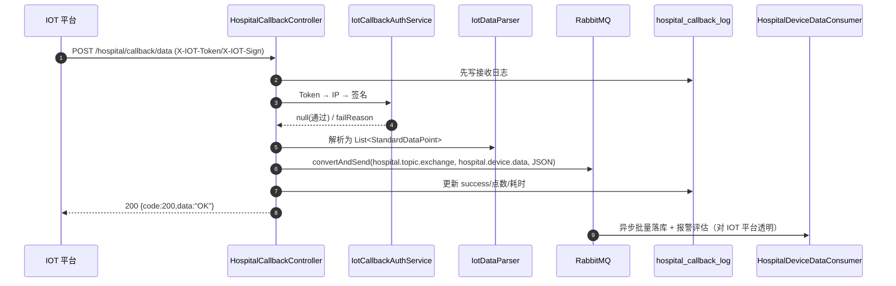
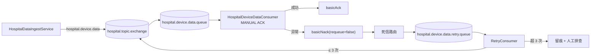

# 智慧能源管理平台 接口设计说明书

| 项目 | 内容 |
| --- | --- |
| 产品名称 | 智慧能源管理平台（zhurong-ems） |
| 系统版本 | V4.6.0 |
| 文档版本 | V1.0 |
| 文档类型 | 接口设计说明书（02-03） |
| 编制日期 | 2026-09-14 |
| 密级 | 内部 |
| 适用读者 | 前后端研发、第三方 IOT 平台对接人员、测试、实施运维 |

> 配套文档：[02-01 概要设计说明书.md](./02-01%20概要设计说明书.md)、[02-02 数据库设计说明书.md](./02-02%20数据库设计说明书.md)。
> 本文 HTTP 接口事实以 `com.cpems.web.controller` 下控制器源码为准；MQTT/MQ 事实以 `com.ruoyi.system.config` 与 `com.ruoyi.system.hospital` 下源码为准。

---

## 目录

1. 接口通用规范
2. 统一错误码
3. 认证与菜单接口
4. 业务域典型 REST 接口清单
5. 医院 IOT HTTP 回调接口专题
6. MQTT Topic 与报文设计
7. RabbitMQ 拓扑设计
8. 外部平台对接（OSS / SMS / 视频 / 系统集成同步）
9. springdoc-openapi 在线接口文档
10. 接口安全设计

---

## 1. 接口通用规范

### 1.1 基础信息

| 项 | 约定 |
| --- | --- |
| 协议 | 生产环境 HTTPS；本地/内网 HTTP |
| 后端地址 | `http://{host}:8088/autoee-iot-ems`（server.port=8088，context-path=/autoee-iot-ems） |
| 前端开发地址 | `http://localhost:9029`（zhurong-admin-ui，dev 模式经代理转发到后端） |
| 报文格式 | `Content-Type: application/json;charset=UTF-8`（除文件上传 multipart/form-data） |
| 字符编码 | UTF-8 |
| 时间格式 | 字符串 `yyyy-MM-dd HH:mm:ss`（医院回调 IOT 原文时间戳以字符串透传留存） |
| 鉴权头 | Sa-Token 令牌（请求头名取 `sa-token.token-name` 配置，OpenAPI 中以 APIKEY Header 方式注入） |
| 认证方式 | Sa-Token + JWT；登录后访问业务接口须携带有效令牌，免登录端点见 5.1 |
| 接口风格 | RESTful，资源名小写中划线/蛇形均沿用控制器现状；系统管理类以 `/system/xxx` 为前缀 |

### 1.2 URL 与 HTTP 方法约定

| 操作 | 方法 | URL 模式 | 示例 |
| --- | --- | --- | --- |
| 分页列表 | GET | `/<domain>/xxx/list` | `GET /system/user/list`、`GET /hospital/device/list` |
| 详情 | GET | `/<domain>/xxx/{id}`（医院新域为 `/info/{id}`） | `GET /system/user/{id}`、`GET /hospital/device/info/{id}` |
| 新增 | POST | `/<domain>/xxx` | `POST /hospital/device` |
| 修改 | PUT | `/<domain>/xxx` | `PUT /hospital/device` |
| 删除 | DELETE | `/<domain>/xxx/{ids}` | `DELETE /system/user/{userIds}` |
| 导出 | POST | `/<domain>/xxx/export` | `POST /hospital/device/export` |
| 批量删除 | DELETE | `/<domain>/xxx/{ids}` | 路径可传多个逗号分隔 ID |

查询参数：列表查询以 QueryString/表单对象接收（BO + PageQuery），分页参数 `pageNum`、`pageSize`，排序 `orderByColumn`、`isAsc`。

### 1.3 统一响应体

业务接口统一返回 `R<T>`（部分老控制器使用等价的 `Ajax`）：

```json
{
  "code": 200,
  "msg": "操作成功",
  "data": {}
}
```

| 字段 | 类型 | 说明 |
| --- | --- | --- |
| code | int | 200 成功；500 失败；其余见错误码表 |
| msg | string | 提示消息（可直接展示，已随 i18n 演进） |
| data | object/array/基础类型 | 业务数据；失败时通常为 null |

### 1.4 分页响应体 TableDataInfo

```json
{
  "code": 200,
  "msg": "查询成功",
  "rows": [ { }, { } ],
  "total": 128
}
```

| 字段 | 类型 | 说明 |
| --- | --- | --- |
| code / msg | — | 同统一响应体 |
| rows | array | 当前页记录（VO 列表） |
| total | long | 总记录数 |

### 1.5 请求头约定

| 请求头 | 必填 | 说明 |
| --- | --- | --- |
| `Authorization` 或配置的 `sa-token.token-name` | 业务接口必填 | `Bearer <JWT>` 或纯 token，以实际 sa-token 配置为准 |
| `Content-Type` | POST/PUT 必填 | application/json |
| `Accept-Language` | 可选 | zh-CN / en / ru / id |
| `X-IOT-Token` | 回调必填 | 医院 IOT 回调令牌（见第 5 章） |
| `X-IOT-Sign` | 条件必填 | 医院 IOT 回调签名（开启签名时） |
| `X-Requested-With` | 可选 | XMLHttpRequest（框架识别异步请求） |

### 1.6 幂等、防重与限流

| 机制 | 落地方式 | 适用场景 |
| --- | --- | --- |
| 防重复提交 | 注解 `@RepeatSubmit`（间隔内相同参数拒绝） | 新增/修改类 POST/PUT，如新增医院设备 |
| 业务幂等键 | 唯一索引（device_code/order_no/msgId 等） | 台账新增、订单落库、回调对账 |
| 回调幂等 | IOT `msgId` 写入 `hospital_callback_log.request_id` | 第三方重试时可识别重复消息；数据点采用追加模型，下游按设备+指标+时间窗消化重复 |
| MQ 至少一次 | 手动 ACK + 死信重试 | 采集链路消费幂等 |
| 限流 | Redis 计数 / Sa-Token 风控（按账号/IP） | 登录、短信验证码、回调入口 |
| 分布式锁 | Lock4j `@Lock4j` | 同步任务、库存、订单流转、报警去重 |

---

## 2. 统一错误码

| code | 含义 | 触发场景/处置 |
| --- | --- | --- |
| 200 | 成功 | `R.ok()` |
| 200 | 操作成功（分页同样 code=200） | TableDataInfo |
| 401 | 未认证/登录失效 | token 缺失、过期；前端跳转登录 |
| 403 | 无权限 | `@SaCheckPermission` 校验失败/数据范围越权 |
| 404 | 资源不存在 | 路径或资源不存在 |
| 500 | 操作失败（业务/系统异常） | `R.fail()`；msg 为具体原因 |
| 601 | 警告（WARN） | `R.warn(msg)`，业务警告但非异常 |
| 业务扩展码 | 参数校验/业务规则失败 | 由全局异常处理器返回可读 msg（如"主键不能为空""X-IOT-Token 无效""来源 IP 不在白名单""签名校验失败"） |

> 说明：系统采用"HTTP 状态码基本为 200 + 业务 code"的模式，前端拦截器统一判断响应体 `code`；回调鉴权失败同样返回 200 包装的 `R.fail("鉴权失败")`，便于 IOT 平台解析 msg 排查（生产也可按对接方要求改为 HTTP 401，以联调约定为准）。

---

## 3. 认证与菜单接口

控制器：`com.cpems.web.controller.system.SysLoginController`、`common.CaptchaController`。以下路径均已含 context-path 前缀（示例中省略 `/autoee-iot-ems`）。

### 3.1 接口清单

| 方法 | 路径 | 说明 | 是否鉴权 |
| --- | --- | --- | --- |
| GET | `/captchaImage` | 获取图形验证码（返回 base64 图片与 uuid，验证码存 Redis） | 否 |
| GET | `/captchaSms` | 获取短信验证码 | 否（限频） |
| POST | `/login` | 账号密码登录（可带验证码） | 否 |
| POST | `/mockLogin` | 免密/模拟登录（仅开发联调，生产禁用） | 否 |
| POST | `/smsLogin` | 短信验证码登录 | 否 |
| POST | `/xcxLogin` | 小程序（uni-app）登录 | 否 |
| POST | `/logout` | 退出登录（令牌注销） | 是 |
| GET | `/getInfo` | 获取当前用户信息（用户、角色、权限集） | 是 |
| GET | `/getRouters` | 获取动态路由（菜单树，驱动前端路由生成） | 是 |

### 3.2 登录

`POST /login`

请求体：

```json
{
  "username": "admin",
  "password": "123456",
  "code": "8a3d",
  "uuid": "captcha-uuid-xxxx"
}
```

响应：

```json
{
  "code": 200,
  "msg": "操作成功",
  "data": {
    "access_token": "eyJhbGciOiJIUzI1NiJ9.....",
    "expire_in": 720
  }
}
```

> token 载荷与字段名以 Sa-Token 配置（`sa-token.token-name`/超时时间）为准；前端将 token 持久化后在后续请求头携带。

### 3.3 获取用户信息

`GET /getInfo`

```json
{
  "code": 200,
  "msg": "操作成功",
  "data": {
    "user": { "userId": 1, "userName": "admin", "nickName": "管理员", "deptId": 100 },
    "roles": ["admin"],
    "permissions": ["*:*:*"]
  }
}
```

### 3.4 获取动态路由

`GET /getRouters`：返回目录/菜单树，每项含 `name/path/component/query/visible/status/perms/icon/children/meta`。前端 `store/modules/permission.js` 的 `GenerateRoutes` 用 `component` 字符串映射 `@/views/**` 组件并动态注入路由；按钮权限通过 `perms`（如 `hospital:device:add`）配合 `v-hasPermi` 控制。

```json
{
  "code": 200,
  "msg": "操作成功",
  "data": [
    {
      "name": "Hospital",
      "path": "/hospital",
      "component": "",
      "meta": { "title": "医院能源", "icon": "monitor" },
      "children": [
        { "name": "HospitalDevice", "path": "device", "component": "hospital/device/index",
          "perms": "hospital:device:list", "meta": { "title": "设备台账" } }
      ]
    }
  ]
}
```

### 3.5 登出

`POST /logout` → `{ "code": 200, "msg": "退出成功" }`，服务端注销会话并清理登录态缓存。

---

## 4. 业务域典型 REST 接口清单

> 约定：表中"路径前缀"为控制器 `@RequestMapping` 值；每个资源一般提供 `list`（GET）、详情（GET）、新增（POST）、修改（PUT）、删除（DELETE）五个标准端点，下表只列关键/特色端点。权限标识与后端 `@SaCheckPermission` 一致，命名规则 `域:资源:动作`。

### 4.1 设备与网关（equipment）

| 方法 | 路径 | 说明 | 权限标识 |
| --- | --- | --- | --- |
| GET | `/equipment/info/list` | 设备列表 | equipment:info:list |
| POST | `/equipment/info` | 新增设备 | equipment:info:add |
| PUT | `/equipment/info` | 修改设备 | equipment:info:edit |
| DELETE | `/equipment/info/{ids}` | 删除设备 | equipment:info:remove |
| GET | `/equipment/gateway/list` | 网关列表 | equipment:gateway:list |
| POST/PUT/DELETE | `/equipment/gateway[...]` | 网关增改删 | equipment:gateway:* |

### 4.2 能源管理（energy / itemizeanalysis）

| 方法 | 路径 | 说明 | 权限标识 |
| --- | --- | --- | --- |
| GET | `/energy/list`、`/energy/data` | 能耗数据列表/曲线 | energy:list |
| GET | `/energy/quality/*` | 电能质量监测 | energy:quality:list |
| GET | `/energy/balance/*` | 能流平衡分析 | energy:balance:list |
| GET/POST | `/benchmark/standard[...]` | 对标基准查询/配置 | energy:benchmark:* |
| POST | `/batch/record/import` | 批量导入记录（EasyExcel） | energy:batch:import |
| GET | `/itemize/analysis/*` | 分项能耗分析（照明/空调/动力等） | itemizeanalysis:list |

### 4.3 报警中心（alarm）

| 方法 | 路径 | 说明 | 权限标识 |
| --- | --- | --- | --- |
| GET | `/alarm/list` | 实时报警列表（RealtimeAlarm，前缀 `/alarm`） | alarm:realtime:list |
| PUT | `/alarm/handle` | 报警确认/处置 | alarm:realtime:handle |
| GET | `/alarm/history/list` | 历史报警 | alarm:history:list |
| GET/POST/PUT/DELETE | `/system/alarmRule[...]` | 报警规则 CRUD（前缀 `/system/alarmRule`） | system:alarmRule:* |

### 4.4 运维巡检（inspection）

| 方法 | 路径 | 说明 | 权限标识 |
| --- | --- | --- | --- |
| GET/POST/PUT/DELETE | `/inspection/plan[...]` | 巡检计划 | inspection:plan:* |
| GET/POST/PUT | `/inspection/record[...]` | 巡检记录/上报 | inspection:record:* |
| GET/POST/PUT | `/repair/order[...]` | 维修工单（报警可自动建工单） | repair:order:* |
| GET/POST | `/inspection/duty[...]`、`/inspection/schedule[...]` | 值班/排班 | inspection:duty:* |
| GET/POST | `/example/report[...]` | 报告样板 | inspection:report:* |

### 4.5 定额与计量（quota / metering）

| 方法 | 路径 | 说明 | 权限标识 |
| --- | --- | --- | --- |
| GET/POST/PUT/DELETE | `/quota/config[...]` | 能耗定额配置与考核 | quota:config:* |
| GET/POST/PUT/DELETE | `/meter/info[...]` | 计量器具台账（ems_meter_info） | metering:meter:* |
| GET/POST/PUT | `/meter/calibration/plan[...]` | 校准计划 | metering:calibrationPlan:* |
| GET/POST/PUT | `/meter/calibration/record[...]` | 校准记录 | metering:calibrationRecord:* |

### 4.6 充电桩运营（chargingStation）

| 方法 | 路径 | 说明 | 权限标识 |
| --- | --- | --- | --- |
| GET/POST/PUT/DELETE | `/charging/station[...]` | 充电站 CRUD | charging:station:* |
| GET/POST/PUT/DELETE | `/charging/pile[...]` | 充电桩 CRUD、空闲状态 | charging:pile:* |
| GET/POST/PUT | `/charging/merchant[...]`、`/charging/brand[...]`、`/charging/model[...]` | 商户/品牌/型号 | charging:merchant/brand/model:* |
| GET | `/charging/order/list` | 充电订单（order_info，order_type=1） | charging:order:list |
| GET/POST | `/charging/occupancy[...]` | 占用订单（order_type=2） | charging:occupancy:* |
| GET/POST/PUT | `/charging/price/strategy[...]`、`/charging/price/param[...]` | 计价策略/参数 | charging:price:* |

### 4.7 医院智慧能源域（hospital，10 个 Controller）

| 资源 | 路径前缀 | 典型端点 | 权限前缀 |
| --- | --- | --- | --- |
| 医院设备台账 | `/hospital/device` | `GET /list`、`GET /info/{id}`、`POST`、`PUT`、`DELETE /{ids}`、`POST /export` | hospital:device |
| 设备数据点 | `/hospital/device/data`（经由设备/监测控制器） | 数据点查询、曲线 | hospital:deviceData |
| IOT 回调 | `/hospital/callback` | `POST /data`（**免登录**，见第 5 章） | 无（Token/IP/签名） |
| 回调日志 | `/hospital/callbackLog` | list、详情、统计 | hospital:callbackLog |
| 指标定义 | `/hospital/metricDef` | CRUD | hospital:metricDef |
| 院区管理 | `/hospital/area` | 院区树 CRUD | hospital:area |
| 实时监测 | `/hospital/monitor` | 总览、设备实时状态、离线统计（阈值 `hospital.iot.monitor-offline-minutes`） | hospital:monitor |
| 能耗分析 | `/hospital/energy` | 总览/趋势/分类/效率/设备排名/节能建议 | hospital:energy |
| 设备工作量 | `/hospital/deviceWorkload` | 检查量录入/查询、单位工作量能耗 | hospital:workload |
| 报警规则 | `/hospital/alarmRule` | CRUD（阈值/离线/升级配置） | hospital:alarmRule |
| 报警记录 | `/hospital/alarmRecord` | list、确认、处置、升级记录 | hospital:alarmRecord |

医院域列表接口示例（分页）：

`GET /hospital/device/list?pageNum=1&pageSize=10&deviceType=CT&status=0`

```json
{
  "code": 200,
  "msg": "查询成功",
  "rows": [
    {
      "id": "1890000000000000001",
      "deviceName": "1号CT",
      "deviceCode": "CT-001",
      "deviceType": "CT",
      "projectCategory": "MEDICAL",
      "areaId": "HQ",
      "deptId": "1001",
      "iotDeviceId": "iot-device-001",
      "status": "0"
    }
  ],
  "total": 1
}
```

### 4.8 系统管理与监控（system / monitor）

| 方法 | 路径 | 说明 |
| --- | --- | --- |
| * | `/system/user[...]`、`/system/role[...]`、`/system/menu[...]`、`/system/dept[...]`、`/system/post[...]` | 用户/角色/菜单/部门/岗位 CRUD、授权 |
| * | `/system/dict/type[...]`、`/system/dict/data[...]` | 字典类型/数据 |
| * | `/system/config[...]` | 参数配置 |
| * | `/system/notice[...]`、`/system/profile[...]` | 通知公告/个人中心 |
| * | `/system/oss[...]`、`/system/ossConfig[...]` | OSS 文件与存储配置 |
| * | `/system/logo[...]`、`/system/itemTopology[...]` | Logo、用能拓扑 |
| * | `/system/mqtt[...]`、`/system/rabbitmq[...]` | MQTT/RabbitMQ 连接参数配置 |
| * | `/system/interfaceConfig[...]`、`/system/integrationConfig[...]`、`/system/apiInterface[...]` | 接口配置/集成配置/API 接口登记 |
| * | `/system/syncTask[...]`、`/system/syncExecution[...]` | 同步任务定义与执行记录 |
| GET/POST | `/monitor/online[...]`、`/monitor/operlog[...]`、`/monitor/logininfor[...]`、`/monitor/cache[...]` | 在线用户/操作日志/登录日志/缓存监控 |

### 4.9 其他业务域

调度决策（dispatch：负荷/需求/电价/天气预测、协同、优化方案/算法、配网节点、调度指令、评估/报告、能源计划、模型配置）、新能源（newenergy：光伏/虚拟电厂/储能/微电网/统计）、数字孪生（digitaltwin：孪生设备/3D 模型/能流）、设备控制（control）、报表（report：引擎/模板）、碳排（carbon）、视频（camera）、统一数据查询（dataQuery）、用水（water）、制度管理（management）、危化品/物资/巡更（autoee）等，均遵循上述 REST 约定与 `域:资源:动作` 权限命名。

---

## 5. 医院 IOT HTTP 回调接口专题

本章面向第三方 IOT 平台对接开发人员，是系统**唯一的免登录机器对接入口**。

### 5.1 端点定义

| 项 | 值 |
| --- | --- |
| 方法与路径 | `POST /hospital/callback/data`（完整：`https://{域名}/autoee-iot-ems/hospital/callback/data`） |
| Controller | `com.cpems.web.controller.hospital.HospitalCallbackController#receive` |
| 认证 | **不走 Sa-Token 登录**；使用 X-IOT-Token + IP 白名单 + 可选签名 |
| Content-Type | application/json |
| 同步语义 | 鉴权 → 解析标准化 → 投递 RabbitMQ → 写回调日志后立即返回；不等待落库 |
| 成功条件 | HTTP 200 且响应体 `code=200`、`data="OK"` |

### 5.2 请求头

| 请求头 | 必填 | 说明 |
| --- | --- | --- |
| `X-IOT-Token` | 是 | 平台颁发的接入令牌，需与服务端配置 `hospital.iot.auth-token` 完全一致（开发默认值 `hospital-iot-2026`，**生产必须更换**） |
| `X-IOT-Sign` | 条件必填 | 签名。仅当服务端 `hospital.iot.sign-enabled=true` 且配置 `sign-secret` 时必填 |
| `Content-Type` | 是 | `application/json;charset=UTF-8` |

> 签名原文中的时间戳取自请求体顶层 `timestamp` 字段、消息 ID 取自 `msgId` 字段（系统未单设 X-Timestamp 请求头，时间随报文体传输）。

### 5.3 请求体（IotCallbackRequest）

| 字段 | 类型 | 必填 | 说明 |
| --- | --- | --- | --- |
| msgId | string | 是 | IOT 平台消息唯一 ID；用于日志留痕、对账与重复识别 |
| timestamp | string | 是 | 消息时间戳，参与签名原文；建议 `yyyy-MM-dd HH:mm:ss` |
| devices | array | 是 | 设备数据列表 |
| devices[].deviceId | string | 是 | IOT 平台设备 ID，须与 `hospital_device.iot_device_id` 绑定 |
| devices[].points | array | 是 | 数据点列表 |
| devices[].points[].metric | string | 是 | 指标编码，对应 `hospital_metric_def.metric_code`（power/electricity/current/voltage/temperature/run_status/alarm_status 等） |
| devices[].points[].value | number/string | 是 | 指标值；number 类型指标传数值，status/string 类型传状态码或字符串 |
| devices[].points[].ts | string | 否 | 采集时间，缺省时以平台接收时间为准 |
| devices[].points[].quality | int | 否 | 数据质量：0 正常（默认），1 异常 |

### 5.4 请求示例

```http
POST /autoee-iot-ems/hospital/callback/data HTTP/1.1
Host: ems.example.com
Content-Type: application/json;charset=UTF-8
X-IOT-Token: hospital-iot-2026
X-IOT-Sign: 9f2c1a7e8b6d4...（开启签名时携带）

{
  "msgId": "msg-20260914-100000-0001",
  "timestamp": "2026-09-14 10:00:00",
  "devices": [
    {
      "deviceId": "iot-device-001",
      "points": [
        { "metric": "power", "value": 12.34, "ts": "2026-09-14 10:00:00", "quality": 0 },
        { "metric": "current", "value": 56.7, "ts": "2026-09-14 10:00:00", "quality": 0 },
        { "metric": "run_status", "value": 1, "ts": "2026-09-14 10:00:00", "quality": 0 }
      ]
    },
    {
      "deviceId": "iot-device-002",
      "points": [
        { "metric": "temperature", "value": 22.5, "ts": "2026-09-14 10:00:00", "quality": 0 }
      ]
    }
  ]
}
```

### 5.5 响应示例

成功（已受理并入 MQ）：

```json
{
  "code": 200,
  "msg": "OK",
  "data": "OK"
}
```

鉴权失败（令牌错误/IP 不在白名单/签名错误）：

```json
{
  "code": 500,
  "msg": "鉴权失败",
  "data": null
}
```

解析/处理异常：

```json
{
  "code": 500,
  "msg": "处理失败：<具体异常信息>",
  "data": null
}
```

> 每次请求无论成败都在 `hospital_callback_log` 落一条日志（request_id=msgId、source_ip、设备数、点数、status=success/auth_fail/parse_fail/fail、error_msg、cost_time），可在"回调日志"页面按 msgId 排查。

### 5.6 签名算法

- 算法：HMAC-SHA256，输出小写（或大写，比较时大小写不敏感）十六进制摘要。
- 密钥：服务端配置 `hospital.iot.sign-secret`，线下分发。
- 签名原文：`timestamp + "\n" + msgId`（timestamp/msgId 均为报文顶层字段；字段为空时以空串参与）。

Java 参考（与服务端实现一致，基于 Hutool）：

```java
String plain = timestamp + "\n" + msgId;
String sign = new HMac(HmacAlgorithm.HmacSHA256, secret.getBytes(StandardCharsets.UTF_8))
        .digestHex(plain.getBytes(StandardCharsets.UTF_8));
// 请求头：X-IOT-Sign: <sign>
```

伪代码示例：

```text
sign = hexlower( HMAC_SHA256( key = signSecret,
                              msg = "2026-09-14 10:00:00\nmsg-20260914-100000-0001" ) )
```

### 5.7 鉴权执行顺序（IotCallbackAuthService）

1. Token 比对：缺失或不匹配 → "X-IOT-Token 无效"。
2. IP 白名单：`hospital.iot.ip-whitelist` 非空时，客户端 IP 须在白名单（逗号/分号分隔）。IP 获取顺序：`X-Forwarded-For` 第一个 → `X-Real-IP` → `RemoteAddr`（适配 Nginx 多级代理）。
3. 签名：开关+密钥同时配置时启用；缺签名 → "缺少签名 X-IOT-Sign"；摘要不一致 → "签名校验失败"。

### 5.8 幂等与重试策略（对接双方约定）

| 场景 | 约定 |
| --- | --- |
| 网络超时/无 200 | IOT 平台使用**相同 msgId** 指数退避重试（建议 1s/5s/30s，最多 3~5 次） |
| 平台收到 code=200/data=OK | 视为已受理，不再重发 |
| 鉴权失败 | 不重试，先排查令牌/白名单/签名 |
| 重复投递 | 平台侧以 msgId 幂等；平台内部数据点追加写入，重复点由消费端按 (设备,指标,ts) 在查询/统计层去重 |
| 乱序 | 允许乱序到达，按数据点自带 `ts` 落库，平台不依赖到达顺序 |
| 批量 | 单报文可携带多设备多点，建议单批 ≤ 500 点；超大批量拆分推送 |
| 落库保障 | 平台内 MQ 手动 ACK，失败进死信队列由 `HospitalDeviceDataRetryConsumer` 最多重投 3 次，超限人工兜底 |

### 5.9 平台内处理时序



### 5.10 StandardDataPoint（平台内部标准模型，跨 MQ 载体）

| 字段 | 类型 | 说明 |
| --- | --- | --- |
| deviceId | long | 本系统设备 ID（hospital_device.id），解析时按 iot_device_id 映射得到 |
| deviceCode | string | 设备编号（TDengine TAG/子表命名要素） |
| metricCode | string | 指标编码 |
| value | decimal | 数值值（number 类型） |
| strValue | string | 状态/字符串值（status/string 类型） |
| ts | datetime | 采集时间 |
| quality | int | 0 正常 / 1 异常 |

---

## 6. MQTT Topic 与报文设计

南向设备/网关 → EMQX（1883 MQTT/TCP，8883 TLS，8083 WSS；Dashboard 18083）。平台 Paho 客户端 QoS=1 订阅，断线 5s 自动重连并重订阅。

### 6.1 Topic 定义（TopicType）

| Topic | 通配 | 含义 | 载荷形式 |
| --- | --- | --- | --- |
| `electric/emsCarson` | 精确 | Carson 电表打包数据 | JSON 对象 |
| `electric/all/+` | 单层通配 | 电表批量上报，按元素 `deviceType` 拆分到 U/I/P/W | JSON 数组 |
| `electric/voltage` | 精确 | 电压 U | JSON 对象 |
| `electric/current` | 精确 | 电流 I | JSON 对象 |
| `electric/power` | 精确 | 功率 P | JSON 对象 |
| `electric/consumption` | 精确 | 用电量 W | JSON 对象 |
| `water/consumption/+` | 单层通配 | 各水表用水量 | JSON 数组，逐条转发 |

### 6.2 报文 JSON 示例

电压/电流/功率/用电量（单对象，平台自动补 `createTime`）：

```json
{
  "clientId": "101_电表01",
  "value": 220.35,
  "createTime": "2026-09-14 10:00:00"
}
```

`electric/all/{gatewaySn}` 批量（数组，按 deviceType 拆分）：

```json
[
  { "clientId": "101_电表01", "deviceType": "electric/voltage", "value": 220.35 },
  { "clientId": "101_电表01", "deviceType": "electric/current", "value": 5.12 },
  { "clientId": "101_电表01", "deviceType": "electric/power", "value": 1.13 },
  { "clientId": "101_电表01", "deviceType": "electric/consumption", "value": 1287.6 }
]
```

`water/consumption/{meterSn}` 用水量（数组）：

```json
[
  { "clientId": "202_水表01", "value": 3.45, "createTime": "2026-09-14 10:00:00" }
]
```

### 6.3 平台转发行为

`MyMQTTCallback.messageArrived` 收到消息后：

1. UTF-8 解析 JSON（对象或数组）；
2. 对缺失的 `createTime` 自动补当前时间（`yyyy-MM-dd HH:mm:ss`）；
3. `rabbitTemplate.convertAndSend("EquipmentTopicExchange", <路由键=TopicType.info>, payload)`；
4. 数组报文（all / water）逐条拆分转发；`deviceType` 无法识别的元素跳过并告警日志。

> MQTT 全链路分析与已知注意事项见 [系统 MQTT使用与架构分析报告](../架构设计/Deep-EMS%20系统%20MQTT使用与架构分析报告.md) 与 [全链路闭环bug分析](../架构设计/MQTT%20%E2%86%92%20RabbitMQ%20%E2%86%92%20存储%20全链路闭环bug分析.md)。

---

## 7. RabbitMQ 拓扑设计

连接：本地 `rabbitmq/rabbitmqpassword`，vhost=`admin_vhost`（示例 compose 为 guest/guest）；端口 5672，管理台 15672。

### 7.1 既有 MQTT 链路：EquipmentTopicExchange

| 类型 | 名称 | durable | 说明 |
| --- | --- | --- | --- |
| Exchange | `EquipmentTopicExchange` | true | topic 类型 |
| Queue | `electric/voltage` | true | 电压，绑定键 `electric/voltage` |
| Queue | `electric/current` | true | 电流，绑定键 `electric/current` |
| Queue | `electric/power` | true | 功率，绑定键 `electric/power` |
| Queue | `electric/consumption` | true | 用电量，绑定键 `electric/consumption` |
| Queue | `water/consumption/+` | true | 用水量，绑定键 `water/consumption/+` |

> 声明类：`com.ruoyi.system.config.RabbitExChangeConfig`；队列名与路由键同字符串（取自 `TopicType.getInfo()`）。

### 7.2 医院回调链路：hospital.topic.exchange

配置前缀 `hospital.iot`（`HospitalIotProperties`）：

| 类型 | 名称（默认值） | 配置键 | 属性 |
| --- | --- | --- | --- |
| Exchange | `hospital.topic.exchange` | hospital.iot.exchange | topic，durable=true |
| Queue（主） | `hospital.device.data.queue` | hospital.iot.queue | durable=true；DLX=hospital.topic.exchange，DLK=`hospital.device.data.retry` |
| Binding（主） | routingKey=`hospital.device.data` | hospital.iot.routing-key | — |
| Queue（重试/死信） | `hospital.device.data.retry.queue` | 常量 RETRY_QUEUE | durable=true |
| Binding（重试） | routingKey=`hospital.device.data.retry` | 常量 RETRY_ROUTING_KEY | — |
| 载荷 | `List<StandardDataPoint>` 的 JSON 字符串 | — | FastJSON 序列化 |

### 7.3 确认与重试



- 主消费者：`ackMode = MANUAL`，成功 `basicAck`；任何异常 `basicNack(deliveryTag, false, false)`，消息经队列 DLX 参数进入重试队列。
- 重试消费者：最大重投次数 `MAX_RETRY_TIMES = 3`；超过上限不再投递，保留消息并告警人工处理。
- 旁路隔离：TDengine 写入、`HospitalAlarmEvalService` 报警评估各自 try-catch，失败不影响 MySQL 批量写入与 ACK。

### 7.4 两条拓扑对照

| 项 | EquipmentTopicExchange | hospital.topic.exchange |
| --- | --- | --- |
| 生产者 | MyMQTTCallback（EMQX 订阅转发） | HospitalDataIngestService（HTTP 回调） |
| 队列数量 | 5（U/I/P/W/水） | 1 主 + 1 重试 |
| 死信重试 | 无独立重试队列（异常单独处理） | 内置 DLX + 3 次重试 |
| 载荷 | Map/数组 JSON | StandardDataPoint 数组 JSON |
| 隔离性 | 既有契约，不可破坏 | 医院独立闭环，可独立演进 |

---

## 8. 外部平台对接（OSS / SMS / 视频 / 系统集成同步）

### 8.1 对象存储 OSS（zhurong-ems-oss，AWS S3 SDK）

- 采用 S3 协议兼容客户端，可对接 MinIO/私有云/公有云 OSS；配置经"系统管理 → OSS 配置"（`sys_oss_config`/`/system/ossConfig`）维护。
- 文件上传：`POST /system/oss/upload`（multipart），返回访问 URL/对象 key；设备图片、单据附件、报表、3D 模型等均存 OSS，业务库只存路径。
- 凭证（endpoint/ak/sk/bucket/region）经配置与环境变量注入，禁止入库明文。

### 8.2 短信 SMS（zhurong-ems-sms，阿里/腾讯）

- 多厂商适配（阿里云/腾讯云），用于登录短信验证码（`/captchaSms`、`/smsLogin`）与报警通知。
- 模板与签名在云平台审核登记，系统侧只存模板 code；发送按手机号 + 场景做 Redis 限频。

### 8.3 邮件与视频平台

- 报警邮件由报警链路按规则中通知人/邮箱发送（SMTP 配置外化）。
- 视频：摄像头配置经 `/camera/config[...]`（camera_config）维护；平台对接方案详见 [视频平台接入方案](../视频平台接入方案.md)。

### 8.4 系统集成与同步引擎

| 能力 | 载体 | 说明 |
| --- | --- | --- |
| 接口登记 | sys_api_interface / `/system/apiInterface` | 登记第三方 API（URL、方法、鉴权、参数） |
| 集成配置 | sys_integration_config / `/system/integrationConfig` | 外部系统集成参数（基地址、凭证、开关） |
| 接口配置 | sys_interface_config / `/system/interfaceConfig` | 接口级映射配置 |
| 同步任务 | sys_sync_task / `/system/syncTask` | 定义周期/手动同步任务（来源、目标、字段映射、调度） |
| 执行记录 | sys_sync_execution / `/system/syncExecution` | 每次执行状态、条数、耗时、错误信息 |
| 执行引擎 | SyncEngine | 由 XXL-Job/手动触发，Lock4j 防并发；失败可按记录重跑 |

对接细节另见 [系统集成模块技术文档](../技术文档/系统集成模块技术文档.md) 与 [系统集成模块用户手册](../用户手册/系统集成模块用户手册.md)。

---

## 9. springdoc-openapi 在线接口文档

- 组件：springdoc-openapi 1.6.15（OpenAPI 3），`springdoc.api-docs.enabled=true`。
- 分组（`group-configs`）：
  - `1.演示模块` → 包 `com.cpems.demo`
  - `2.系统模块` → 包 `com.cpems.web`（**业务接口主分组**）
  - `3.代码生成模块` → 包 `com.cpems.generator`
- 访问地址（含 context-path）：
  - Swagger UI：`http://{host}:8088/autoee-iot-ems/swagger-ui/index.html`
  - OpenAPI JSON：`http://{host}:8088/autoee-iot-ems/v3/api-docs`，分组：`/v3/api-docs/2.系统模块`
  - 网关放行路径包含 `/*/api-docs`、`/*/api-docs/**`
- 鉴权：UI 中通过 Authorize 填入 Sa-Token 令牌（APIKEY，Header 名取 `${sa-token.token-name}`），`persistAuthorization=true` 保持刷新后不丢令牌。
- 文档元信息：标题 `${zhurong-ems.name}后台管理系统_接口文档`，版本 4.6.0，联系人 cpems。
- 生产建议：按环境关闭或加访问控制，避免接口暴露。

---

## 10. 接口安全设计

| 类别 | 措施 |
| --- | --- |
| 身份认证 | 除登录/验证码/回调外，全部接口须携带有效 Sa-Token JWT；令牌有过期时间，支持登出注销 |
| 权限控制 | `@SaCheckPermission("域:资源:动作")` 注解校验；菜单（路由可见）、按钮（v-hasPermi）、接口（注解）三级一致 |
| 数据权限 | RuoYi `@DataScope` 按角色 data_scope 拼接部门过滤；医院域 `HospitalDataScopeService` 实现院区/科室数据隔离 |
| 回调安全 | X-IOT-Token 令牌 + IP 白名单 + HMAC-SHA256 签名三重；回调端点独立免登录、不产生会话 |
| 传输安全 | 生产 HTTPS；MQTT 支持 TLS(8883)/WSS(8083)；中间件账号最小权限、独立 vhost |
| 输入校验 | JSR-303 分组校验（AddGroup/EditGroup，`@NotNull/@NotBlank`）；XSS 过滤器转义；全局异常统一返回 |
| SQL 注入 | MyBatis `#{}` 预编译；TDengine 动态子表名 `${tbName}` 在代码侧白名单清洗（仅允许字母数字下划线） |
| 越权与枚举 | 主键级操作校验归属；批量操作按权限标识控制 |
| 防重放/重复提交 | `@RepeatSubmit`；回调 msgId 留痕；签名携带 timestamp（可扩展时效窗口校验） |
| 限流 | 登录、短信、回调入口基于 Redis/账号/IP 限频 |
| 审计 | 业务写操作 `@Log` 记 sys_oper_log；登录记 sys_logininfor；机器回调记 hospital_callback_log |
| 敏感信息 | 日志不打印密码/令牌/签名密钥；错误消息不回显堆栈与内部地址 |
| CORS/网关 | 跨域与白名单在框架/Nginx 统一配置；仅放行必要的文档与登录路径 |

### 10.1 回调联调检查清单

1. `hospital.iot.auth-token` 已更换为生产强随机值并线下同步；
2. `hospital.iot.ip-whitelist` 已配置对端出口 IP（经 Nginx 时确认真实 IP 透传头正确）；
3. 需要防篡改时 `sign-enabled=true` 并分发 `sign-secret`，双方法对 timestamp+"\n"+msgId 的 HMAC-SHA256 结果一致；
4. 对方设备已在"医院设备台账"建档且 `iot_device_id` 与推送 deviceId 一致；指标编码已在"指标定义"存在；
5. 在"回调日志"页能用 msgId 查到 success 记录，且数据点/报警页面可见数据；
6. 失败重试用同一 msgId，平台死信重试与人工兜底流程已演练。

---

*— 本文档基于 V4.6.0 控制器与接入链路源码编制，文档版本 V1.0，2026-09-14。*
