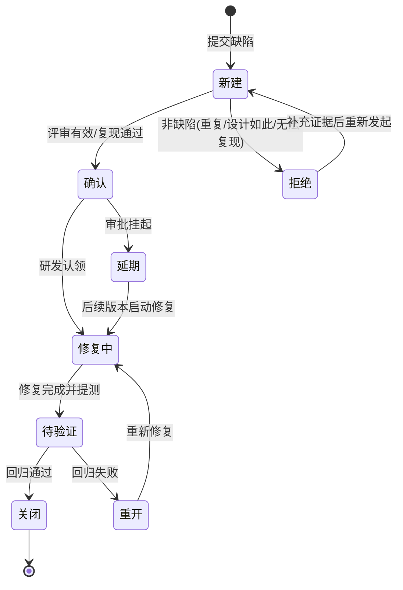

# 缺陷管理与测试报告规范

## 文档信息

| 项目 | 内容 |
| --- | --- |
| 文档名称 | V4.6.0 缺陷管理与测试报告规范 |
| 文档编号 | QA-STD-2026-003 |
| 文档版本 | V1.0 |
| 系统版本 | Deep-EMS（zhurong-ems）V4.6.0 |
| 编制日期 | 2026-09-14 |
| 适用范围 | 项目全体测试、研发、产品、实施人员 |
| 配套文档 | [04-01 测试计划.md](04-01%20测试计划.md)、[04-02 测试用例（功能测试）.md](04-02%20测试用例（功能测试）.md)、[../测试用例/安全测试计划.md](../测试用例/安全测试计划.md)、[../测试用例/性能测试计划.md](../测试用例/性能测试计划.md)、[../测试用例/系统集成测试用例.md](../测试用例/系统集成测试用例.md) |

---

## 1 缺陷生命周期与状态机

### 1.1 缺陷状态定义

| 状态 | 含义 | 进入条件 | 责任角色 |
| --- | --- | --- | --- |
| 新建（New） | 缺陷刚被提交，尚未评审 | 测试/任何角色提交 | 提交人 |
| 确认（Confirmed） | 经评审确认为有效缺陷并完成分级 | 评审/复现通过 | 测试经理/研发负责人 |
| 修复中（In Progress） | 研发已接单正在修复 | 研发认领 | 研发 |
| 待验证（Resolved） | 研发修复完成并合入提测分支 | 提交修复说明与版本号 | 研发 |
| 关闭（Closed） | 回归验证通过 | 测试回归通过 | 测试 |
| 重开（Reopened） | 回归未通过或修复引入新问题 | 回归失败 | 测试 |
| 拒绝（Rejected） | 非缺陷：重复、无法复现、设计如此、外部原因 | 评审否决 | 研发/产品，测试确认 |
| 延期（Deferred） | 确认有效但本版本不修复，经审批挂起 | 豁免审批通过 | 项目经理 |

### 1.2 状态流转图

### 1.3 流转规则

1. 任何人不得直接关闭他人提交的缺陷；关闭权限归测试，S1/S2 关闭须测试经理复核。
2. "拒绝"必须填写理由（重复单号/设计依据/外部系统原因），提交人 1 个工作日内确认，分歧由测试经理裁决。
3. "延期"仅限 S3/S4，须填写影响、规避方案、计划版本并经项目经理审批；S1/S2 不允许延期。
4. "重开"须注明未通过的回归用例与新版本号；同一缺陷第 2 次重开升级至研发负责人处理。
5. 每次状态变更记录操作人、时间、评论，形成完整审计链。

### 1.4 响应与修复时限（SLA）

| 严重级 | 响应时限 | 修复时限（目标） | 回归时限 |
| --- | --- | --- | --- |
| S1 致命 | 15 分钟内响应 | 4 小时内给出处置，24 小时内修复或有可行规避 | 修复后 2 小时内 |
| S2 严重 | 2 小时内响应 | 2 个工作日 | 当日/次日 |
| S3 一般 | 1 个工作日 | 本里程碑内 | 下一轮回归 |
| S4 轻微 | 2 个工作日 | 视排期修复 | 版本回归 |

---

## 2 严重级与优先级定义

### 2.1 严重级（Severity）

| 级别 | 名称 | 判定标准 | 典型示例 |
| --- | --- | --- | --- |
| S1 | 致命 | 系统不可用、核心链路中断、数据丢失/错乱、安全防线被突破 | 后端无法启动；医院回调鉴权被绕过；MQ 消费丢数据；所有页面 500；SQL 注入拖库 |
| S2 | 严重 | 主要功能不可用且无规避；性能/可靠性指标严重不达标；重要数据计算错误 | 报警阈值不触发；同环比计算错误；回调 TPS 远低于 1000；TDengine 开启后采集阻断；越权可看跨院区数据 |
| S3 | 一般 | 次要功能异常、有规避路径；非核心计算误差；兼容性局部问题 | 某筛选条件结果错误；导出 PDF 分页错乱；Firefox 下按钮错位；提示文案不准 |
| S4 | 轻微 | 界面瑕疵、文案、格式、建议性问题，不影响业务 | 错别字、对齐/颜色不一致、英文译文大小写问题、空数据缺占位提示 |

### 2.2 优先级（Priority）

| 优先级 | 含义 | 处理时机 | 参考映射 |
| --- | --- | --- | --- |
| P0 | 阻断，必须最先修 | 立即停下手头工作 | S1 一般定 P0；部分影响验收的 S2 定 P0 |
| P1 | 高，本里程碑必须闭环 | 排入当前迭代优先做 | 多数 S2、部分 S3 |
| P2 | 中，版本内解决 | 排入迭代 | 多数 S3 |
| P3 | 低，可排期/延期 | 有余量或后续版本 | S4 与可延期 S3 |

> 严重级描述"对系统的破坏程度"，优先级描述"修复的紧迫程度"，二者独立评定；例如罕见路径下的 S2 可定 P1，而影响演示的 S4 可临时升 P2。

---

## 3 缺陷单字段模板与填写范例

### 3.1 缺陷单字段模板

| 字段 | 填写要求 |
| --- | --- |
| 缺陷标题 | 【模块】+现象+结果，一句话概括，禁止"有问题/报错" |
| 所属模块 | 选择末级模块（如 医院回调/HCB） |
| 严重级/优先级 | S1~S4 / P0~P3 |
| 所属版本/里程碑 | 如 V4.6.0_M2_TY1、M2 |
| 环境 | DEV/TEST/UAT；TDengine 开/关；浏览器及版本 |
| 前置条件 | 账号角色、数据状态、中间件状态 |
| 复现步骤 | 编号步骤，可由他人独立复现 |
| 测试数据 | 报文、设备编码、SQL、截图、录屏链接 |
| 实际结果 | 客观描述观察到的现象，附日志关键字/接口响应 |
| 预期结果 | 应有的正确表现及需求/设计依据 |
| 复现概率 | 必现/偶现（x/y 次） |
| 关联用例/需求 | TC 编号、需求跟踪矩阵编号 |
| 附件 | 截图、录屏、har、回调报文样例、日志 |

### 3.2 填写范例

| 字段 | 内容 |
| --- | --- |
| 标题 | 【医院回调】X-IOT-Sign 错误时仍返回成功并落库 |
| 模块 | 医院 IOT 回调（HCB） |
| 严重级/优先级 | S1 / P0 |
| 版本/环境 | V4.6.0_M1_TY2 / TEST，TDengine 开启，Chrome 最新版（curl 复现） |
| 前置条件 | IP 已加白名单，X-IOT-Token 正确，HMAC 密钥为 K1 |
| 复现步骤 | 1 用 curl 发送合法报文确认成功；2 保持 body 与 Token 不变，将 X-IOT-Sign 改为任意错误值；3 再发送并查询 MySQL |
| 测试数据 | `curl -X POST .../hospital/callback -H "X-IOT-Token: t-001" -H "X-IOT-Sign: wrongsign" -d @case01.json`（报文见附件） |
| 实际结果 | 接口返回 200 success；hospital 数据表新增 1 条记录，队列计数 +1 |
| 预期结果 | 签名不一致应返回鉴权失败（401/业务错误码），不入队、不落库，并记录安全日志（依据接口设计说明书及 TC-HCB-004） |
| 复现概率 | 必现（5/5） |
| 关联 | TC-HCB-004；需求 REQ-H-005 |
| 附件 | curl 命令、响应截图、错误报文 case01.json、后端日志关键字 `HmacVerify` |

---

## 4 缺陷度量与统计分析

### 4.1 度量指标

| 指标 | 计算公式 | 目标/参考 | 用途 |
| --- | --- | --- | --- |
| 缺陷密度 | 缺陷总数 ÷ 规模（千行代码或功能点） | 按历史基线对比，逐版本下降 | 评价代码质量 |
| 逃逸率 | 上线后 30 天内用户发现缺陷数 ÷ 缺陷总数 | ≤ 3% | 评价测试拦截能力 |
| 重开率 | 重开缺陷数 ÷ 待验证缺陷数 | ≤ 5% | 评价修复质量 |
| 平均修复时长 MTTR | Σ（关闭时间−确认时间）÷ 关闭缺陷数 | S1≤24h、S2≤2d（分等级统计） | 评价修复效率 |
| 缺陷有效率 | 有效缺陷数 ÷ 提交缺陷总数（=1−拒绝率） | ≥ 90% | 评价提单质量 |
| S1/S2 占比 | S1+S2 数 ÷ 缺陷总数 | 准出时趋近 0 | 评价严重程度 |
| 遗留缺陷数 | 准出时未关闭缺陷数 | 满足准出标准 | 放行风险评估 |

统计周期：日（新增/关闭）、里程碑（全量指标）、版本（趋势对比）。数据以缺陷管理平台导出为准，人工不得删改已关闭缺陷。

### 4.2 分析方法

| 方法 | 用途 | 输出形式 |
| --- | --- | --- |
| 帕累托分析（二八图） | 按模块/根因统计缺陷数，识别 TOP 问题模块 | 柱状降序+累计百分比折线，锁定累计 80% 的模块重点回归 |
| 鱼骨图（因果分析） | 对 S1/S2 与重复重开缺陷做根因分析 | 人/机/料/法/环/测六类鱼骨，输出根因与改进项 |
| 缺陷趋势图 | 每日新增、关闭、净增、累计曲线 | 判断收敛拐点；上线前新增应持续低于关闭、遗留趋零 |
| 缺陷分布矩阵 | 严重级×模块、优先级×状态交叉表 | 定位高风险模块（如 HCB、MQTT、报警） |
| 缺陷年龄分析 | 缺陷从确认到关闭的停留时长分布 | 发现超期停滞缺陷，推动站会清理 |

### 4.3 分析结论要求

里程碑/版本分析报告须回答：缺陷是否收敛、TOP 模块根因是什么、重开缺陷暴露了什么流程问题、下阶段改进动作（含责任人和期限）。

---

## 5 测试日报与周报模板

### 5.1 测试日报

| 项目 | 内容 |
| --- | --- |
| 报告日期/版本/里程碑 | 例：2026-09-18，V4.6.0_M1_TY2，M1 |
| 今日进展 | 执行用例数/通过数/失败数/阻塞数；新增覆盖模块；完成的专项（如回调重试验证） |
| 缺陷情况 | 新增（按 S1~S4）、关闭、重开、遗留；S1/S2 清单及当前状态 |
| 用例进度 | 计划数/已执行数/执行率/通过率（表格或数字） |
| 风险与阻塞 | 环境、数据、联调、未定需求等，需谁协调 |
| 明日计划 | 具体任务与责任人 |

日报正文建议控制在一页内，数据以表格呈现。

### 5.2 测试周报

| 章节 | 要点 |
| --- | --- |
| 一、本周概览 | 版本、里程碑、整体结论（红/黄/绿灯） |
| 二、用例执行 | 本周与累计执行率、通过率，按模块统计表 |
| 三、缺陷统计 | 新增/关闭/遗留、等级分布、帕累托 TOP5、重开清单、MTTR |
| 四、趋势图 | 新增/关闭/累计趋势截图或表格 |
| 五、专项进展 | 性能、安全、可靠性、兼容性、国际化等 |
| 六、风险与应对 | 风险项、等级、责任人、截止时间 |
| 七、下周计划 | 任务、里程碑节点、资源需求 |

---

## 6 阶段性测试报告模板

> 里程碑报告（M1~M4）与系统测试总结报告统一采用本模板；总结报告各章必须填写完整，里程碑报告可裁剪非适用章节并注明"本里程碑不适用"。

### 6.1 报告封面与测试结论

| 项目 | 内容 |
| --- | --- |
| 项目名称 | 智慧能源管理平台 V4.6.0（含医院智慧能源决策系统） |
| 报告类型 | Mx 里程碑报告 / 系统测试总结报告 |
| 测试周期 | 20xx-xx-xx ~ 20xx-xx-xx |
| 被测版本 | 后端 jar 版本、前端 dist 版本、SQL/脚本版本 |
| 报告人/审核人/日期 |  |

**测试结论（四选一，写明依据）**：

- 通过：满足准出标准，建议上线/进入下一阶段；
- 附条件通过：遗留 S3 均有规避与豁免，建议带已知问题上线；
- 不通过：存在未闭环 S1/S2 或非功能指标不达标；
- 暂停：环境/数据/版本问题导致无法继续。

### 6.2 测试范围与覆盖

| 维度 | 计划覆盖 | 实际覆盖 | 说明 |
| --- | --- | --- | --- |
| 业务模块 | （列模块） |  | 未覆盖项及原因 |
| 需求条目 | 需求跟踪矩阵条目数 | 已关联用例数/覆盖率 |  |
| 测试类型 | 功能/接口/集成/性能/安全/兼容/可靠性/国际化/多端 | 实际执行类型 |  |
| 双态环境 | TDengine 开/关 | 各执行轮次 |  |

### 6.3 用例执行汇总表

| 模块 | 用例总数 | 已执行 | 通过 | 失败 | 阻塞 | 未执行 | 通过率 |
| --- | --- | --- | --- | --- | --- | --- | --- |
| （逐模块填写，与 04-02 模块一致） |  |  |  |  |  |  |  |
| 合计 | 140（基线，以实际为准） |  |  |  |  |  |  |

统计口径：通过率=通过数÷已执行数；执行率=已执行数÷总数；失败用例必须 100% 关联缺陷。

### 6.4 缺陷汇总

按模块统计：

| 模块 | S1 | S2 | S3 | S4 | 合计 | 已关闭 | 遗留 | 重开数 |
| --- | --- | --- | --- | --- | --- | --- | --- | --- |
| 医院回调 HCB |  |  |  |  |  |  |  |  |
| MQTT 采集 |  |  |  |  |  |  |  |  |
| …（全模块） |  |  |  |  |  |  |  |  |
| 合计 |  |  |  |  |  |  |  |  |

按等级、按日期趋势：附"每日新增/关闭/累计遗留"表与趋势结论（是否收敛、拐点日期）。
根因分析：附帕累托 TOP5 模块与 S1/S2 鱼骨分析结论。

### 6.5 性能结果对照表

| 指标 | 验收标准 | 实测结果 | 压测模型 | 结论 |
| --- | --- | --- | --- | --- |
| 医院回调吞吐 | ≥ 1000 TPS（稳定 10min） |  | 阶梯 200→1200 TPS | 达标/不达标 |
| 回调错误率/丢数 | 错误率 ≤ 0.1%，零丢失 |  | 发送=入库+拒绝计数对账 |  |
| 普通查询响应 | P95 ≤ 1s |  | 50/100/200 并发混合查询 |  |
| 大屏首屏 | ≤ 3s |  | 清缓存多次计时 |  |
| 核心链路可用性 | ≥ 99.9% |  | 考核窗口拨测/监控 |  |
| MQTT 高并发 | 1.2 倍峰值无丢失 |  | simulator 2000 设备混合 U/I/P/W |  |
| RabbitMQ 堆积恢复 | 10 万堆积可追平 |  | 停消费者灌量后恢复 |  |
| TDengine 读写 | 联动写入不丢、查询 P95≤1s |  | 随回调压测+时序查询 |  |

> 每次结论须附压测参数、监控截图、计数对账表；不达标项必须有调优与复测记录。历史基线见 [../测试用例/性能测试计划.md](../测试用例/性能测试计划.md)。

### 6.6 安全测试结论

| 检查域 | 结果 | 残留问题 |
| --- | --- | --- |
| 鉴权与会话（Sa-Token/JWT） | 通过/不通过 |  |
| 三类越权与院区数据隔离 |  |  |
| 回调 Token/HMAC 签名/重放/IP 白名单 |  |  |
| SQL 注入/XSS/文件上传导出 |  |  |
| 弱口令、敏感数据、日志脱敏 |  |  |

结论明确：高危及以上问题数、是否全部闭环、可否放行。详细检查表引用 [../测试用例/安全测试计划.md](../测试用例/安全测试计划.md)；系统集成域引用 [../测试用例/系统集成测试用例.md](../测试用例/系统集成测试用例.md)。

### 6.7 遗留风险清单与豁免审批

| 缺陷号 | 等级 | 问题描述 | 影响范围 | 规避方案 | 计划版本 | 申请人 | 审批人 |
| --- | --- | --- | --- | --- | --- | --- | --- |
| BUG-xxxx | S3 |  |  |  | V4.6.x |  | 项目经理 |

规则：S1/S2 不得豁免；S3 遗留不超过 3 条且全部具备可操作规避方案；S4 列表备案。未审批的遗留问题视为不满足准出。

### 6.8 上线建议

| 项 | 建议 |
| --- | --- |
| 总体意见 | 建议上线/灰度上线/暂缓上线 |
| 发布范围 | 全量/分院区灰度；TDengine 开/关配置 |
| 发布顺序与回滚 | 中间件配置→SQL 增量→后端→前端；回滚步骤与数据回滚预案 |
| 上线后观察 | 2 周观察期，回调 TPS/错误率、MQ 堆积、死信、报警、大屏可用性日报 |
| 应急联系人 | 研发/测试/运维/医院侧对接人及联系方式 |

### 6.9 签字页

| 角色 | 姓名 | 意见 | 签字 | 日期 |
| --- | --- | --- | --- | --- |
| 测试经理 |  |  |  |  |
| 研发负责人 |  |  |  |  |
| 产品负责人 |  |  |  |  |
| 项目经理 |  |  |  |  |
| 运维/实施负责人 |  |  |  |  |

---

## 7 回归测试策略

### 7.1 用例分级与回归集

| 回归集 | 构成 | 触发时机 | 执行要求 |
| --- | --- | --- | --- |
| 冒烟集（BVT） | P0 核心链路约 7~15 条（登录、MQTT 采集、报警触发、能耗查询、医院回调、大屏、设备网关） | 每次提测/部署后 | 30 分钟内完成，失败即驳回版本 |
| 全量回归集 | 04-02 全部 140 条 + 集成/性能/安全配套用例 | M4 准出前、大版本发布 | 100% 执行，P0/P1 通过率 100% |
| 增量回归集 | 本次改动模块用例 + 影响面用例（由代码影响分析圈定） | 每个里程碑、缺陷批量修复后 | 改动模块全量 + 公共链路（鉴权/采集/报警/落库）必跑 |
| 缺陷回归集 | 本轮所有待验证缺陷对应用例及相邻功能点 | 每日随版本 | 重开缺陷升级处理并扩大相邻回归 |

### 7.2 加性项目回归要求

1. 医院模块为加性开发：每个里程碑除新增用例外，公共组件（Sa-Token、动态菜单、MyAckReceiver、报警引擎、TDengine 写入层）必须执行影响面回归。
2. 修复 S1/S2 时，除缺陷用例外必须回归所在模块 P0/P1 与一条跨模块链路用例。
3. TDengine 开/关两种模式下冒烟集各跑一轮；医院回调用例在 M4 双模式全量执行。

### 7.3 自动化建议

| 层级 | 建议 | 优先级 |
| --- | --- | --- |
| 接口自动化 | 基于 springdoc 契约沉淀 REST 接口断言；医院回调使用 curl/脚本固化 15 类场景（含错误签名、重放、批量、死信对账）纳入 CI | 高 |
| 采集链路对账 | simulator 发送计数与 MySQL/TDengine/死信计数自动对账脚本，作为发布门禁 | 高 |
| 单元回归 | 研发维护 HMAC 校验、报文解析、计费、同环比算法单测，JaCoCo 关键分支 ≥ 70% | 高 |
| UI 自动化 | 对登录、能耗查询、报警列表、医院大屏等稳定主流程做 E2E（慎用于频繁变动页面） | 中 |
| 性能基线 | 1000 TPS 回调脚本、P95 查询脚本版本化，里程碑自动触发摸底 | 中 |

---

## 8 上线后观察与缺陷预防

### 8.1 上线后观察（2 周）

| 观察项 | 方式 | 频率 | 阈值/动作 |
| --- | --- | --- | --- |
| 回调 TPS 与错误率 | 回调日志/监控 | 每日 | 错误率 > 0.1% 立即排查 |
| RabbitMQ 堆积与死信 | 队列监控 | 每日 | 出现死信当日定位并重放，核对不丢数 |
| MQTT 在线设备与缺口 | EMQX+落库对账 | 每日 | 在线率骤降/数据缺口告警 |
| 核心服务可用性 | Spring Boot Admin/拨测 | 实时+日报 | < 99.9% 启动应急 |
| 慢查询与 P95 | 后端日志/慢 SQL | 每周 | P95 > 1s 的接口进入优化清单 |
| 大屏可用性 | 现场/拨测 | 每日 | 白屏/超 3s 即时处理 |
| 业务异常反馈 | 用户/医院侧渠道 | 实时 | 按缺陷流程提单并跟踪 |

### 8.2 缺陷预防

1. 复盘机制：每个 S1/S2 缺陷在关闭后 3 个工作日内完成鱼骨根因复盘，输出"根因—修复—预防项—责任人—完成时间"。
2. 前移拦截：高频缺陷类型（如空指针、越权、计算口径、时区/时间戳）转化为代码评审检查项与单元测试清单。
3. 用例反哺：上线后发现的逃逸缺陷必须补成功能用例与自动化脚本，防止复发。
4. 契约管控：医院回调报文、签名、白名单、MQ 死信参数变更必须同步更新接口设计文档并通知测试回归。
5. 质量度量闭环：每版本对比缺陷密度、逃逸率、重开率趋势，未达标项纳入下一版本质量改进计划。
