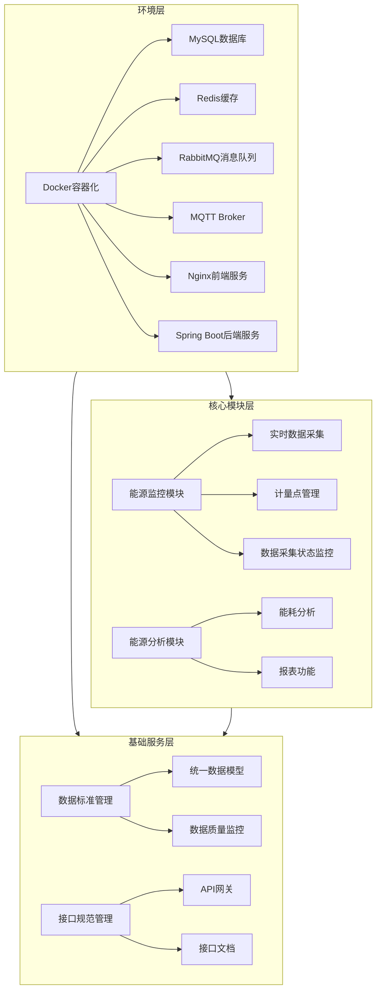

# 第一阶段：基础建设详细设计

**文档版本**: V1.0  
**创建日期**: 2026-03-27  
**适用项目**: 钢厂智慧能碳管理平台  
**基础平台**: Deep-EMS（祝融能源管理系统）

---

## 目录

1. [模块定位与目标](#一模块定位与目标)
2. [功能架构](#二功能架构)
3. [详细功能设计](#三详细功能设计)
4. [数据结构设计](#四数据结构设计)
5. [接口设计](#五接口设计)
6. [实现方案](#六实现方案)
7. [风险评估与应对](#七风险评估与应对)
8. [验收标准](#八验收标准)

---

## 一、模块定位与目标

### 1.1 模块定位

第一阶段作为整个项目的基础建设阶段，主要负责：
- 完成Deep-EMS基础环境部署和核心功能验证
- 建立统一的数据标准和接口规范
- 增强能源监控和能源分析模块，提升核心功能覆盖度
- 为后续阶段的功能开发和高级特性奠定基础

### 1.2 设计目标

1. **环境部署目标**：完成Docker容器化部署，搭建完整的开发、测试和生产环境
2. **核心功能目标**：能源监控模块覆盖度提升至90%，能源分析模块覆盖度提升至90%
3. **数据标准目标**：建立统一的数据采集、存储和处理标准
4. **接口规范目标**：制定标准化的API接口规范，确保系统间集成的一致性
5. **技术基础目标**：完善技术架构，为后续功能扩展做好准备

### 1.3 技术架构

**后端技术栈**
- 基础框架：Spring Boot 2.x
- 持久层：MyBatis Plus + Sa-Token
- 数据库：MySQL 8.0 + Redis 7.2 + TDengine 3.2.2
- 消息队列：RabbitMQ 3.12
- 物联网协议：MQTT（Spring Integration）
- 任务调度：XXL-Job 2.3.1

**前端技术栈**
- 前端框架：Vue 2.6.12
- UI组件库：Element UI 2.15.12
- 数据可视化：ECharts 5.4.0
- 路由管理：Vue Router 3.4.9
- 状态管理：Vuex 3.6.0

---

## 二、功能架构

### 2.1 整体架构



### 2.2 模块依赖关系

| 模块 | 依赖模块 | 依赖关系 |
|------|---------|----------|
| 环境部署 | - | 基础依赖 |
| 能源监控模块 | 环境部署 | 强依赖 |
| 能源分析模块 | 能源监控模块 | 强依赖 |
| 数据标准管理 | 环境部署 | 强依赖 |
| 接口规范管理 | 环境部署 | 强依赖 |

---

## 三、详细功能设计

### 3.1 环境部署与基础验证

#### 3.1.1 Docker容器化部署

| 功能点 | 功能描述 | 实现方式 | 详细说明 |
|--------|---------|----------|----------|
| 容器编排 | 使用Docker Compose编排多容器应用 | Docker Compose | 定义完整的服务栈，包括MySQL、Redis、RabbitMQ、MQTT、Nginx和应用服务 |
| 环境配置 | 环境变量管理和配置文件挂载 | Docker环境变量 | 通过.env文件和配置文件挂载实现环境隔离 |
| 网络配置 | 容器间网络通信 | Docker网络 | 创建自定义网络，确保容器间安全通信 |
| 存储管理 | 数据持久化存储 | Docker卷 | 配置数据卷，确保数据持久化 |

#### 3.1.2 核心功能验证

| 功能点 | 功能描述 | 实现方式 | 详细说明 |
|--------|---------|----------|----------|
| 运维管理验证 | 验证运维管理模块功能 | 功能测试 | 测试设备管理、巡检管理、维修管理等核心功能 |
| 碳资产管理验证 | 验证碳资产管理模块功能 | 功能测试 | 测试碳排放计算、碳资产统计、碳报告生成等功能 |
| 视频监控验证 | 验证视频监控模块功能 | 功能测试 | 测试视频流接入、视频回放、视频分析等功能 |
| 数据看板验证 | 验证数据看板模块功能 | 功能测试 | 测试各类数据看板的展示和交互功能 |

### 3.2 能源监控模块增强

#### 3.2.1 实时能源数据采集

| 功能点 | 功能描述 | 实现方式 | 详细说明 |
|--------|---------|----------|----------|
| 数据采集配置 | 配置数据采集参数和规则 | 后端API | 支持配置采集频率、数据过滤规则、异常处理策略 |
| 实时数据展示 | 实时展示能源数据 | 前端页面 | 支持多种图表展示，数据更新频率可配置 |
| 数据采集状态监控 | 监控采集设备状态 | 后端服务 | 实时监控设备在线状态、数据采集成功率 |
| MQTT协议接入优化 | 优化MQTT消息处理 | 后端服务 | 支持批量消息处理、消息缓存、断线重连 |
| 设备心跳监测 | 监测设备连接状态 | 后端服务 | 定期发送心跳包，检测设备在线状态 |

#### 3.2.2 计量点管理

| 功能点 | 功能描述 | 实现方式 | 详细说明 |
|--------|---------|----------|----------|
| 计量点管理 | 管理能源计量点信息 | 后端API | 支持计量点的增删改查，包含基本信息、技术参数 |
| 虚拟计量点 | 创建虚拟计量点 | 后端服务 | 基于物理计量点数据计算生成虚拟计量点 |
| 离线计量点 | 管理离线计量点 | 后端服务 | 支持手动录入离线计量点数据，支持批量导入 |
| 计量点前端页面 | 计量点管理前端界面 | 前端页面 | 支持计量点列表展示、详情查看、编辑操作 |
| Modbus TCP协议支持 | 支持Modbus TCP协议 | 后端服务 | 实现Modbus TCP协议数据采集，支持多种设备类型 |

### 3.3 能源分析模块增强

#### 3.3.1 能耗分析功能

| 功能点 | 功能描述 | 实现方式 | 详细说明 |
|--------|---------|----------|----------|
| 能耗概况 | 展示能耗总体情况 | 前端页面 | 显示总能耗、单位能耗、能耗趋势等关键指标 |
| 能耗趋势分析 | 分析能耗变化趋势 | 后端服务 | 支持按日、周、月、年分析能耗趋势 |
| 同比环比分析 | 与历史数据对比分析 | 后端服务 | 支持同比、环比分析，计算变化率 |
| 分项能耗分析 | 分析各分项能耗情况 | 后端服务 | 支持按能源类型、区域、设备等维度分析 |
| 能源流向分析 | 分析能源流向和分配 | 前端页面 | 可视化展示能源流向图，支持交互式操作 |

#### 3.3.2 报表功能

| 功能点 | 功能描述 | 实现方式 | 详细说明 |
|--------|---------|----------|----------|
| 损耗分析 | 分析能源损耗情况 | 后端服务 | 计算损耗率，分析损耗原因 |
| 费用报表 | 生成能源费用报表 | 后端服务 | 基于能耗数据和价格生成费用报表 |
| 报表模板设计 | 设计报表模板 | 前端页面 | 支持自定义报表模板，包含多种图表类型 |
| 报表生成引擎 | 生成各类报表 | 后端服务 | 支持定时生成和手动生成报表 |
| 报表导出功能 | 导出报表为多种格式 | 后端服务 | 支持导出为Excel、PDF、CSV等格式 |
| 报表定时任务 | 定时生成和发送报表 | 后端服务 | 支持配置定时任务，自动发送报表 |

### 3.4 数据标准与接口规范

| 功能点 | 功能描述 | 实现方式 | 详细说明 |
|--------|---------|----------|----------|
| 统一数据模型 | 定义统一的数据结构 | 后端服务 | 制定标准的数据模型，确保数据一致性 |
| 数据质量监控 | 监控数据质量 | 后端服务 | 检测数据异常、缺失、重复等问题 |
| API网关 | 统一API管理 | 后端服务 | 集中管理所有API接口，提供统一的访问控制 |
| 接口文档 | 生成API接口文档 | 后端服务 | 自动生成API文档，支持Swagger格式 |

---

## 四、数据结构设计

### 4.1 核心数据模型

#### 4.1.1 计量点数据模型

| 字段名 | 数据类型 | 描述 | 约束 |
|--------|---------|------|------|
| id | BIGINT | 计量点ID | 主键 |
| code | VARCHAR(50) | 计量点编码 | 唯一 |
| name | VARCHAR(100) | 计量点名称 | 非空 |
| type | VARCHAR(20) | 计量点类型 | 非空 |
| energy_type | VARCHAR(20) | 能源类型 | 非空 |
| unit | VARCHAR(10) | 单位 | 非空 |
| installation_date | DATETIME | 安装日期 | - |
| status | VARCHAR(20) | 状态 | 非空 |
| location | VARCHAR(200) | 安装位置 | - |
| description | TEXT | 描述 | - |
| create_time | DATETIME | 创建时间 | 非空 |
| update_time | DATETIME | 更新时间 | - |

#### 4.1.2 能源数据模型

| 字段名 | 数据类型 | 描述 | 约束 |
|--------|---------|------|------|
| id | BIGINT | 数据ID | 主键 |
| meter_id | BIGINT | 计量点ID | 外键 |
| value | DOUBLE | 数值 | 非空 |
| collect_time | DATETIME | 采集时间 | 非空 |
| status | VARCHAR(20) | 数据状态 | 非空 |
| quality | VARCHAR(20) | 数据质量 | - |
| create_time | DATETIME | 创建时间 | 非空 |

#### 4.1.3 设备数据模型

| 字段名 | 数据类型 | 描述 | 约束 |
|--------|---------|------|------|
| id | BIGINT | 设备ID | 主键 |
| code | VARCHAR(50) | 设备编码 | 唯一 |
| name | VARCHAR(100) | 设备名称 | 非空 |
| type | VARCHAR(50) | 设备类型 | 非空 |
| model | VARCHAR(100) | 设备型号 | - |
| manufacturer | VARCHAR(100) | 制造商 | - |
| installation_date | DATETIME | 安装日期 | - |
| status | VARCHAR(20) | 运行状态 | 非空 |
| ip_address | VARCHAR(50) | IP地址 | - |
| port | INT | 端口号 | - |
| protocol | VARCHAR(50) | 通信协议 | - |
| create_time | DATETIME | 创建时间 | 非空 |
| update_time | DATETIME | 更新时间 | - |

### 4.2 数据库表结构

#### 4.2.1 计量点表 (`meter_point`)

```sql
CREATE TABLE `meter_point` (
  `id` BIGINT NOT NULL AUTO_INCREMENT,
  `code` VARCHAR(50) NOT NULL UNIQUE,
  `name` VARCHAR(100) NOT NULL,
  `type` VARCHAR(20) NOT NULL,
  `energy_type` VARCHAR(20) NOT NULL,
  `unit` VARCHAR(10) NOT NULL,
  `installation_date` DATETIME,
  `status` VARCHAR(20) NOT NULL,
  `location` VARCHAR(200),
  `description` TEXT,
  `create_time` DATETIME NOT NULL,
  `update_time` DATETIME,
  PRIMARY KEY (`id`)
) ENGINE=InnoDB DEFAULT CHARSET=utf8mb4;
```

#### 4.2.2 能源数据表 (`energy_data`)

```sql
CREATE TABLE `energy_data` (
  `id` BIGINT NOT NULL AUTO_INCREMENT,
  `meter_id` BIGINT NOT NULL,
  `value` DOUBLE NOT NULL,
  `collect_time` DATETIME NOT NULL,
  `status` VARCHAR(20) NOT NULL,
  `quality` VARCHAR(20),
  `create_time` DATETIME NOT NULL,
  PRIMARY KEY (`id`),
  KEY `idx_meter_collect` (`meter_id`, `collect_time`)
) ENGINE=InnoDB DEFAULT CHARSET=utf8mb4;
```

#### 4.2.3 设备表 (`device`)

```sql
CREATE TABLE `device` (
  `id` BIGINT NOT NULL AUTO_INCREMENT,
  `code` VARCHAR(50) NOT NULL UNIQUE,
  `name` VARCHAR(100) NOT NULL,
  `type` VARCHAR(50) NOT NULL,
  `model` VARCHAR(100),
  `manufacturer` VARCHAR(100),
  `installation_date` DATETIME,
  `status` VARCHAR(20) NOT NULL,
  `ip_address` VARCHAR(50),
  `port` INT,
  `protocol` VARCHAR(50),
  `create_time` DATETIME NOT NULL,
  `update_time` DATETIME,
  PRIMARY KEY (`id`)
) ENGINE=InnoDB DEFAULT CHARSET=utf8mb4;
```

### 4.3 时序数据库设计

#### 4.3.1 TDengine表结构

```sql
-- 创建数据库
CREATE DATABASE IF NOT EXISTS deep_ems;

-- 使用数据库
USE deep_ems;

-- 创建超级表
CREATE STABLE IF NOT EXISTS energy_meter (
    ts TIMESTAMP,
    value DOUBLE,
    status VARCHAR(20),
    quality VARCHAR(20)
) TAGS (
    meter_id BIGINT,
    meter_code VARCHAR(50),
    energy_type VARCHAR(20),
    unit VARCHAR(10)
);

-- 创建子表（示例）
CREATE TABLE IF NOT EXISTS meter_1001 USING energy_meter TAGS (1001, 'M1001', 'electricity', 'kWh');
```

---

## 五、接口设计

### 5.1 环境部署接口

| 接口名称 | URL | 方法 | 功能描述 | 请求参数 | 成功响应 |
|---------|-----|------|----------|----------|----------|
| 容器状态查询 | /api/deploy/container/status | GET | 查询容器运行状态 | - | `{"code": 200, "data": [{"name": "mysql", "status": "running"}]}` |
| 服务状态查询 | /api/deploy/service/status | GET | 查询服务运行状态 | - | `{"code": 200, "data": [{"name": "backend", "status": "up"}]}` |
| 环境信息查询 | /api/deploy/environment | GET | 查询环境配置信息 | - | `{"code": 200, "data": {"version": "1.0.0", "env": "prod"}}` |

### 5.2 能源监控接口

| 接口名称 | URL | 方法 | 功能描述 | 请求参数 | 成功响应 |
|---------|-----|------|----------|----------|----------|
| 计量点列表 | /api/energy/meter/list | GET | 获取计量点列表 | page, size, keyword | `{"code": 200, "data": {"total": 100, "rows": [...]}}` |
| 计量点详情 | /api/energy/meter/{id} | GET | 获取计量点详情 | id | `{"code": 200, "data": {...}}` |
| 计量点创建 | /api/energy/meter | POST | 创建计量点 | meter对象 | `{"code": 200, "data": {"id": 1}}` |
| 实时数据查询 | /api/energy/data/realtime | GET | 查询实时数据 | meterIds, limit | `{"code": 200, "data": [...]}` |
| 历史数据查询 | /api/energy/data/history | GET | 查询历史数据 | meterId, start, end, interval | `{"code": 200, "data": [...]}` |

### 5.3 能源分析接口

| 接口名称 | URL | 方法 | 功能描述 | 请求参数 | 成功响应 |
|---------|-----|------|----------|----------|----------|
| 能耗概况 | /api/analysis/overview | GET | 获取能耗概况 | start, end | `{"code": 200, "data": {...}}` |
| 趋势分析 | /api/analysis/trend | GET | 获取能耗趋势 | start, end, interval | `{"code": 200, "data": [...]}` |
| 同比环比 | /api/analysis/compare | GET | 获取同比环比数据 | period, type | `{"code": 200, "data": {...}}` |
| 报表生成 | /api/analysis/report/generate | POST | 生成报表 | reportType, params | `{"code": 200, "data": {"reportId": 1}}` |
| 报表导出 | /api/analysis/report/export | GET | 导出报表 | reportId, format | 文件流 |

### 5.4 数据标准接口

| 接口名称 | URL | 方法 | 功能描述 | 请求参数 | 成功响应 |
|---------|-----|------|----------|----------|----------|
| 数据模型列表 | /api/standard/model/list | GET | 获取数据模型列表 | - | `{"code": 200, "data": [...]}` |
| 数据质量检查 | /api/standard/quality/check | POST | 检查数据质量 | dataType, params | `{"code": 200, "data": {...}}` |
| 接口规范查询 | /api/standard/interface/spec | GET | 查询接口规范 | interfaceId | `{"code": 200, "data": {...}}` |

---

## 六、实现方案

### 6.1 环境部署实现

#### 6.1.1 Docker Compose配置

```yaml
version: '3.8'
services:
  mysql:
    image: mysql:8.0
    container_name: mysql
    environment:
      MYSQL_ROOT_PASSWORD: root
      MYSQL_DATABASE: deep_ems
    ports:
      - "3306:3306"
    volumes:
      - mysql-data:/var/lib/mysql
    networks:
      - deep-ems-network

  redis:
    image: redis:7.2
    container_name: redis
    ports:
      - "6379:6379"
    volumes:
      - redis-data:/data
    networks:
      - deep-ems-network

  rabbitmq:
    image: rabbitmq:3.12-management
    container_name: rabbitmq
    ports:
      - "5672:5672"
      - "15672:15672"
    volumes:
      - rabbitmq-data:/var/lib/rabbitmq
    networks:
      - deep-ems-network

  mqtt:
    image: eclipse-mosquitto:2.0
    container_name: mqtt
    ports:
      - "1883:1883"
      - "9001:9001"
    volumes:
      - mqtt-config:/mosquitto/config
      - mqtt-data:/mosquitto/data
    networks:
      - deep-ems-network

  backend:
    build: ./backend
    container_name: backend
    ports:
      - "8080:8080"
    depends_on:
      - mysql
      - redis
      - rabbitmq
      - mqtt
    environment:
      - SPRING_PROFILES_ACTIVE=prod
    volumes:
      - backend-logs:/app/logs
    networks:
      - deep-ems-network

  frontend:
    build: ./frontend
    container_name: frontend
    ports:
      - "80:80"
    depends_on:
      - backend
    networks:
      - deep-ems-network

volumes:
  mysql-data:
  redis-data:
  rabbitmq-data:
  mqtt-config:
  mqtt-data:
  backend-logs:

networks:
  deep-ems-network:
    driver: bridge
```

#### 6.1.2 环境初始化脚本

```bash
#!/bin/bash

# 启动所有服务
docker-compose up -d

# 等待服务启动
sleep 30

# 初始化数据库
docker exec -i mysql mysql -u root -proot deep_ems < init.sql

# 初始化Redis
docker exec -i redis redis-cli FLUSHALL

# 检查服务状态
docker-compose ps

echo "环境部署完成！"
```

### 6.2 能源监控模块实现

#### 6.2.1 实时数据采集服务

```java
@Service
public class DataCollectionService {
    
    @Autowired
    private MqttPahoClientFactory mqttClientFactory;
    
    @Autowired
    private EnergyDataRepository energyDataRepository;
    
    @Autowired
    private RedisTemplate<String, String> redisTemplate;
    
    public void startCollection() {
        // 初始化MQTT客户端
        MqttPahoMessageDrivenChannelAdapter adapter = new MqttPahoMessageDrivenChannelAdapter(
            "collector", mqttClientFactory, "energy/#"
        );
        
        // 处理接收到的消息
        adapter.setOutputChannel(new MessageChannel() {
            @Override
            public boolean send(Message<?> message) {
                String payload = (String) message.getPayload();
                processMqttMessage(payload);
                return true;
            }
        });
        
        adapter.start();
    }
    
    private void processMqttMessage(String payload) {
        // 解析MQTT消息
        // 存储数据到数据库和时序数据库
        // 更新Redis缓存
    }
}
```

#### 6.2.2 计量点管理实现

```java
@RestController
@RequestMapping("/api/energy/meter")
public class MeterPointController {
    
    @Autowired
    private MeterPointService meterPointService;
    
    @GetMapping("/list")
    public Result list(@RequestParam int page, @RequestParam int size, @RequestParam(required = false) String keyword) {
        Page<MeterPoint> meterPoints = meterPointService.list(page, size, keyword);
        return Result.success(meterPoints);
    }
    
    @PostMapping
    public Result create(@RequestBody MeterPoint meterPoint) {
        Long id = meterPointService.create(meterPoint);
        return Result.success(id);
    }
    
    // 其他接口方法
}
```

### 6.3 能源分析模块实现

#### 6.3.1 能耗分析实现

```java
@Service
public class EnergyAnalysisService {
    
    @Autowired
    private EnergyDataRepository energyDataRepository;
    
    public EnergyOverview getOverview(Date startDate, Date endDate) {
        // 计算总能耗
        // 计算单位能耗
        // 分析能耗趋势
        return new EnergyOverview();
    }
    
    public List<TrendData> getTrend(Date startDate, Date endDate, String interval) {
        // 按指定间隔分析能耗趋势
        return new ArrayList<>();
    }
    
    public CompareData getCompare(String period, String type) {
        // 计算同比环比数据
        return new CompareData();
    }
}
```

#### 6.3.2 报表生成实现

```java
@Service
public class ReportService {
    
    @Autowired
    private EnergyAnalysisService energyAnalysisService;
    
    @Autowired
    private TemplateEngine templateEngine;
    
    public Long generateReport(String reportType, Map<String, Object> params) {
        // 根据报表类型生成报表
        // 存储报表信息
        return 1L;
    }
    
    public byte[] exportReport(Long reportId, String format) {
        // 导出报表为指定格式
        return new byte[0];
    }
}
```

### 6.4 数据标准与接口规范实现

#### 6.4.1 数据模型管理

```java
@Service
public class DataModelService {
    
    public List<DataModel> listModels() {
        // 获取所有数据模型
        return new ArrayList<>();
    }
    
    public DataQualityResult checkQuality(String dataType, Map<String, Object> params) {
        // 检查数据质量
        return new DataQualityResult();
    }
}
```

#### 6.4.2 API网关实现

```java
@Configuration
public class ApiGatewayConfig {
    
    @Bean
    public RouteLocator customRouteLocator(RouteLocatorBuilder builder) {
        return builder.routes()
            .route("energy", r -> r.path("/api/energy/**")
                .uri("http://backend:8080"))
            .route("analysis", r -> r.path("/api/analysis/**")
                .uri("http://backend:8080"))
            .route("standard", r -> r.path("/api/standard/**")
                .uri("http://backend:8080"))
            .build();
    }
}
```

---

## 七、风险评估与应对

### 7.1 风险识别

| 风险编号 | 风险描述 | 风险等级 | 发生概率 | 影响程度 |
|---------|---------|---------|---------|---------|
| R1 | 环境部署复杂度高 | 中 | 60% | 高 |
| R2 | 数据采集稳定性问题 | 高 | 50% | 高 |
| R3 | 时序数据库性能问题 | 中 | 40% | 中 |
| R4 | 多协议集成难度大 | 中 | 45% | 中 |
| R5 | 数据标准不统一 | 低 | 30% | 中 |

### 7.2 风险应对措施

#### R1：环境部署复杂度高

**应对措施**：
1. 编写详细的部署文档和脚本
2. 采用Docker Compose实现一键部署
3. 建立部署验证机制
4. 预留部署缓冲时间

**责任人**：运维工程师  
**应对时间**：第1周

#### R2：数据采集稳定性问题

**应对措施**：
1. 实现数据采集重试机制
2. 建立数据缓存和断点续传
3. 监控采集设备状态
4. 实现采集故障自动恢复

**责任人**：后端工程师  
**应对时间**：第2-3周

#### R3：时序数据库性能问题

**应对措施**：
1. 优化TDengine配置
2. 合理设计数据分片策略
3. 实现数据压缩和归档
4. 定期性能测试和调优

**责任人**：DBA  
**应对时间**：第3-4周

#### R4：多协议集成难度大

**应对措施**：
1. 采用协议适配器模式
2. 开发统一的设备接入框架
3. 建立协议测试验证机制
4. 优先实现核心协议支持

**责任人**：后端工程师  
**应对时间**：第4-6周

#### R5：数据标准不统一

**应对措施**：
1. 制定详细的数据标准文档
2. 实现数据验证和转换机制
3. 建立数据标准审核流程
4. 定期检查数据标准执行情况

**责任人**：数据架构师  
**应对时间**：第1-2周

### 7.3 风险监控机制

- **监控频率**：每周风险评估会议
- **监控方式**：项目管理工具跟踪
- **预警机制**：设置风险阈值，超过阈值及时预警
- **应对流程**：建立风险应对流程，确保及时处理

---

## 八、验收标准

### 8.1 功能验收标准

| 验收项 | 验收标准 | 验收方式 |
|-------|---------|---------|
| 环境部署 | Docker容器化部署成功，所有服务正常运行 | 功能测试 |
| 能源监控 | 实时数据采集正常，计量点管理功能完整 | 功能测试 |
| 能源分析 | 能耗分析准确，报表生成正常 | 功能测试 |
| 数据标准 | 数据模型完整，数据质量检查有效 | 功能测试 |
| 接口规范 | API接口符合规范，文档完整 | 文档审查 |

### 8.2 性能验收标准

| 验收项 | 验收标准 | 验收方式 |
|-------|---------|---------|
| 数据采集延迟 | 设备数据采集延迟 < 5s | 性能测试 |
| 数据查询响应 | 历史数据查询响应时间 < 2s | 性能测试 |
| 系统并发 | 支持500并发用户 | 压力测试 |
| 报表生成 | 常规报表生成时间 < 10s | 性能测试 |

### 8.3 安全验收标准

| 验收项 | 验收标准 | 验收方式 |
|-------|---------|---------|
| 认证授权 | 系统登录认证正常，权限控制有效 | 安全测试 |
| 数据传输 | 敏感数据传输加密 | 安全测试 |
| 接口安全 | 接口鉴权有效，防SQL注入 | 安全测试 |
| 日志审计 | 操作日志完整，可追溯 | 安全测试 |

### 8.4 文档验收标准

| 验收项 | 验收标准 | 验收方式 |
|-------|---------|---------|
| 部署文档 | 部署步骤详细，可操作性强 | 文档审查 |
| 技术文档 | 技术架构清晰，接口文档完整 | 文档审查 |
| 测试文档 | 测试计划完整，测试用例覆盖全面 | 文档审查 |
| 用户文档 | 用户操作手册详细，易于理解 | 文档审查 |

---

## 九、附录

### 9.1 术语表

| 术语 | 说明 |
|-----|------|
| Deep-EMS | 祝融能源管理系统，基于Ruoyi框架开发 |
| TDengine | 时序数据库，用于存储时间序列数据 |
| MQTT | 物联网通信协议，用于设备数据传输 |
| Modbus | 工业通信协议，用于设备数据采集 |
| API网关 | 统一管理API接口的服务 |

### 9.2 参考文档

1. [Deep-EMS产品设计文档](file:///d:/code/gitcp/inspur-ems/deep-ems/docs/Deep-EMS产品设计文档.md)
2. [Deep-EMS开发计划](file:///d:/code/gitcp/inspur-ems/deep-ems/docs/Deep-EMS开发计划.md)
3. [系统功能清单](file:///d:/code/gitcp/inspur-ems/deep-ems/docs/系统功能清单.md)
4. [Docker官方文档](https://docs.docker.com/)
5. [TDengine官方文档](https://docs.taosdata.com/)

### 9.3 版本记录

| 版本 | 日期 | 作者 | 说明 |
|-----|------|------|------|
| V1.0 | 2026-03-27 | 技术负责人 | 初始版本 |

---

**文档结束**