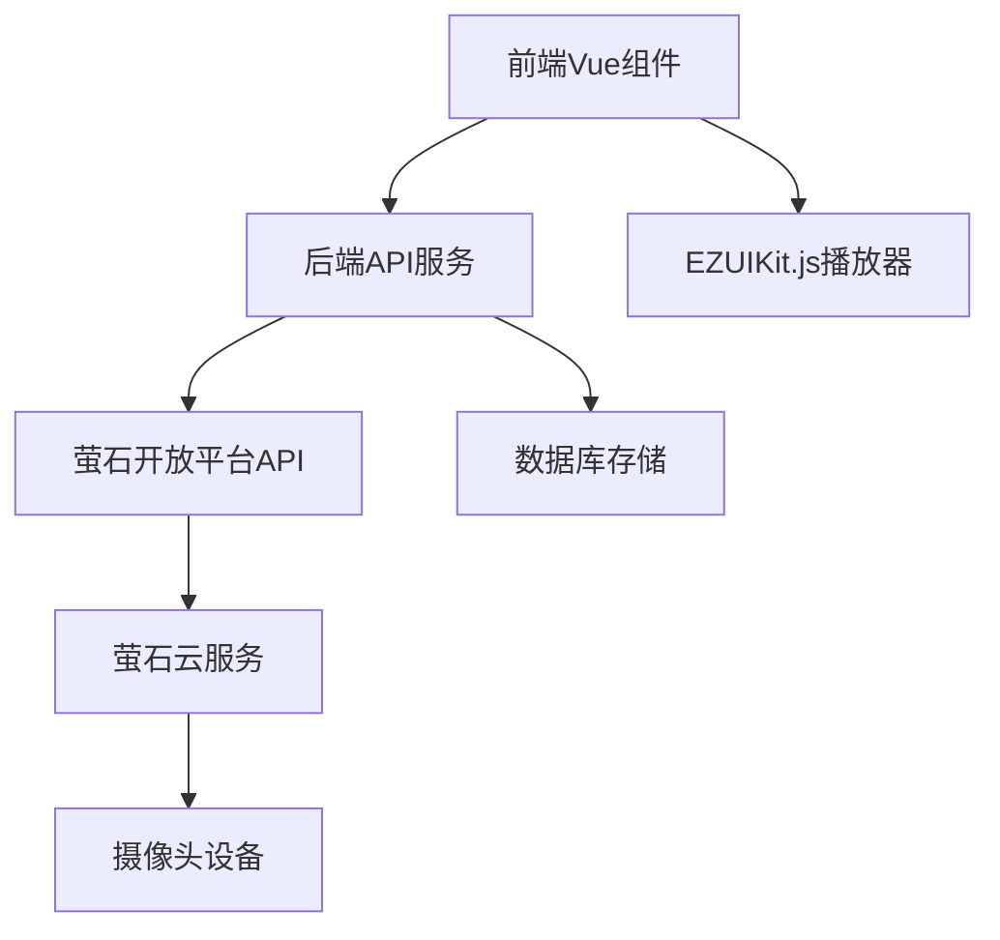
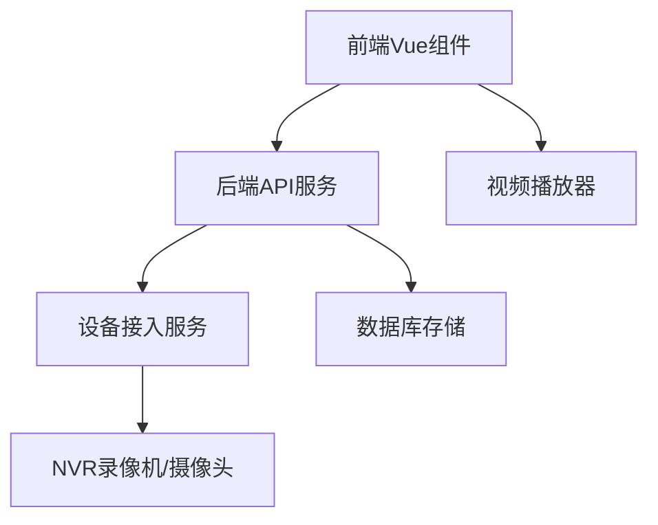

# 视频平台接入方案

## 1. 萤石平台监控设备对接

### 1.1 架构设计

#### 1.1.1 系统架构

#### 1.1.2 数据流
1. **配置流程**：用户在前端配置摄像头信息 → 后端存储到数据库
2. **播放流程**：前端请求播放地址 → 后端调用萤石API获取token和播放地址 → 前端使用EZUIKit播放视频

### 1.2 实现方案

#### 1.2.1 前端实现
- **组件**：`CameraPlay.vue` 组件，使用 `EZUIKit.js` 实现视频播放
- **API调用**：通过 `getUrlBySerialNumber` 接口获取视频播放信息
- **播放参数**：需要 `accessToken` 和 `url` 参数

#### 1.2.2 后端实现
- **服务接口**：`ICameraConfigService` 提供视频配置管理和播放地址获取
- **核心方法**：
  - `getUrlBySerialNumber`：根据序列号获取播放地址
  - `getAccessToken`：获取萤石平台访问令牌
  - `getUrl`：获取视频播放地址
- **API调用**：调用萤石开放平台 `https://open.ys7.com/api/lapp/v2/live/address/get` 接口

#### 1.2.3 数据库设计
- **表结构**：`camera_config` 表
- **字段**：
  - `id`：主键
  - `camera_name`：摄像头名称
  - `camera_brand`：品牌
  - `camera_sn`：序列号
  - `camera_token`：视频token
  - `camera_key`：视频key
  - `camera_secret`：视频secret
  - `area_id`：区域id

### 1.3 配置方法

#### 1.3.1 萤石平台配置
1. **注册萤石账号**：访问 [萤石开放平台](https://open.ys7.com/)
2. **创建应用**：在开发者中心创建应用，获取 `AppKey` 和 `AppSecret`
3. **添加设备**：将摄像头设备添加到萤石云平台
4. **获取设备信息**：获取设备序列号、设备key等信息

#### 1.3.2 系统配置
1. **前端配置**：
   - 登录系统，进入「摄像头配置」页面
   - 点击「新增」按钮，填写摄像头信息
   - 输入摄像头名称、品牌、序列号、视频key、视频secret、所在区域
   - 点击「保存」按钮

2. **后端配置**：
   - 确保后端服务可以访问萤石开放平台API
   - 配置网络防火墙，允许后端服务访问 `open.ys7.com`

## 2. NVR录像机/摄像头接入方案

### 2.1 架构设计

#### 2.1.1 系统架构

#### 2.1.2 接入方式
- **直接接入**：摄像头直接接入网络，通过IP地址访问
- **NVR接入**：通过NVR录像机管理多个摄像头

### 2.2 实现方案

#### 2.2.1 直接接入方案
1. **设备配置**：
   - 摄像头连接网络，配置固定IP地址
   - 开启摄像头的RTSP服务
   - 设置摄像头的用户名和密码

2. **系统配置**：
   - 在「摄像头配置」页面添加摄像头信息
   - 填写摄像头名称、品牌、IP地址、端口、用户名、密码
   - 选择接入类型为「直接接入」

3. **播放实现**：
   - 前端使用支持RTSP的播放器
   - 后端提供RTSP地址生成服务

#### 2.2.2 NVR接入方案
1. **设备配置**：
   - NVR录像机连接网络，配置固定IP地址
   - 添加摄像头到NVR录像机
   - 开启NVR的RTSP服务
   - 设置NVR的用户名和密码

2. **系统配置**：
   - 在「摄像头配置」页面添加NVR信息
   - 填写NVR名称、品牌、IP地址、端口、用户名、密码
   - 选择接入类型为「NVR接入」
   - 配置NVR下的摄像头通道

3. **播放实现**：
   - 前端使用支持RTSP的播放器
   - 后端根据NVR信息和通道号生成RTSP地址

### 2.3 关键配置

#### 2.3.1 网络配置
- **网络拓扑**：确保摄像头/NVR与系统在同一网络或可访问网络
- **端口映射**：如果摄像头在局域网内，需要配置端口映射
- **防火墙**：确保系统可以访问摄像头/NVR的端口

#### 2.3.2 设备配置
- **IP地址**：设置固定IP地址，避免IP冲突
- **RTSP服务**：开启RTSP服务，默认端口为554
- **用户认证**：设置强密码，定期更换
- **视频编码**：选择合适的视频编码格式，如H.264/H.265

#### 2.3.3 系统配置
- **接入类型**：选择「直接接入」或「NVR接入」
- **设备信息**：填写完整的设备信息，包括IP地址、端口、用户名、密码
- **通道配置**：对于NVR接入，配置摄像头通道号
- **区域配置**：关联摄像头到相应的区域

## 3. 技术参数

### 3.1 萤石平台API
- **API地址**：`https://open.ys7.com/api/`
- **认证方式**：基于AppKey和AppSecret的认证
- **接口速率**：根据萤石平台限制

### 3.2 视频播放器
- **前端播放器**：EZUIKit.js（萤石平台）、video.js（通用RTSP）
- **播放协议**：RTMP、RTSP、HLS
- **视频格式**：H.264、H.265

### 3.3 系统要求
- **前端**：支持现代浏览器，如Chrome、Firefox、Edge
- **后端**：Java 8+，Spring Boot 2.0+
- **网络**：稳定的网络连接，带宽根据摄像头数量和分辨率调整

## 4. 部署与维护

### 4.1 部署步骤
1. **前端部署**：部署Vue前端应用
2. **后端部署**：部署Java后端服务
3. **数据库部署**：创建数据库表结构
4. **设备接入**：配置摄像头/NVR设备
5. **系统配置**：在系统中添加摄像头信息

### 4.2 维护要点
- **设备状态监控**：定期检查摄像头在线状态
- **网络带宽监控**：确保网络带宽满足视频传输需求
- **存储管理**：定期清理视频缓存和日志
- **安全管理**：定期更新设备密码，检查系统安全

### 4.3 常见问题
1. **视频无法播放**：检查设备在线状态、网络连接、配置信息
2. **播放卡顿**：检查网络带宽、设备性能、视频编码
3. **权限错误**：检查设备用户名和密码，萤石平台授权
4. **连接超时**：检查网络连接，设备防火墙设置

## 5. 总结

本方案提供了两种视频接入方式：
1. **萤石平台接入**：通过萤石云服务实现摄像头接入，适合分散部署的摄像头
2. **直接/NVR接入**：通过局域网直接接入摄像头或NVR，适合集中部署的场景

系统采用前后端分离架构，前端使用Vue和EZUIKit.js实现视频播放，后端使用Java提供API服务，支持多种视频设备的接入和管理。